<!-- page 1 -->

## VORTEX DYNAMICS IN THE CYLINDER WAKE

*C.* H. *K. Williamson*

Mechanical and Aerospace Engineering, Upson Hall, Cornel1 University, Ithaca, New York 14853

KEY **WORDS:** wakes, instability, vortex shedding

#### ABSTRACT

Since the review of periodic flow phenomena by Berger & Wille (1972) in this journal, over twenty years ago, there has been a surge of activity regarding bluff body wakes. Many of the questions regarding wake vortex dynamics from the earlier review have now been answered in the literature, and perhaps an essential key to our new understandings (and indeed to new questions) has been the recent focus, over the past eight years, on the three-dimensional aspects of nominally two-dimensional wake flows. New techniques in experiment, using laser-induced fluorescence and PIV **(Particle-Image-Velocimetry),** are vigorously being applied to wakes, but interestingly, several of the new discoveries have come from careful use of classical methods. There is no question that strides forward in understanding of the wake problem are being made possible by ongoing threedimensional direct numerical simulations, as well as by the surprisingly successful use of analytical modeling in these flows, and by secondary stability analyses. These new developments, and the discoveries of several new phenomena in wakes, are presented in this review.

#### 1. INTRODUCTION

Despite the fact that two-dimensional (2-D) and three-dimensional (3-D) vortical instabilities in wakes have been a subject of interest to engineers as well as to scientists for a great many years, an understanding of the flow behind a bluff body poses a great challenge. Bluff body wakes are complex; they involve

<!-- page 2 -->

the interactions of three shear layers in the same problem, namely a boundary layer, a separating free shear layer, and a wake. **As** has been recently remarked by Roshko (1993), "the problem of bluff body flow remains almost entirely in the empirical, descriptive realm of knowledge," although our knowledge of this flow is extensive. In fact, the recent surge of activity on wakes over the past decade from experiment, direct numerical simulation, and analysis has yielded a wealth of new understandings. In the case of the circular cylinder wake alone, there have been literally hundreds of papers, in part due to its engineering significance, and in part due to the tempting simplicity in setting up such an arrangement in an experimental or computational laboratory. Rather than attempt here to describe the vortex dynamics in both unseparated (for example, splitter-plate flows) and separated wakes for all the different types of **3-D** and nominally **2-D** body shapes, an overview is presented of the vortex dynamics phenomena in the wake of a circular cylinder, over a wide range of Reynolds numbers.

The nominally **2-D** vortex shedding process has been described in a number of review papers in the past fifty years. However, very little attention has been given to **3-D** vortex dynamics phenomena, and indeed there are no review papers addressing this aspect in any depth, despite the many new results now appearing. For example, 3-D shedding patterns have now been modeled in analysis using Ginzburg-Landau-type equations. Direct numerical simulations **(DNS)** are now becoming significant to our understanding of 3-D wake instabilities. Precise predictions, from Floquet analysis, of critical Reynolds number and spanwise wavelengths for wake transition, are appearing for the first time. The concepts of absolute and convective instabilities have been introduced in this field, and the inception of wake instability has been described in terms of a Hopf bifurcation. Most of the above examples of new research have been supported by the emerging immense computing power. In experiments, significant steps forward in our understanding of wake vortex dynamics have come from the many recent studies of **3-D** phenomena, which have led to some new explanations of long-standing controversies that were hitherto assumed to have two-dimensional origins. Our focus in this review is on these new discoveries, and we also review **2-D** wake phenomena. Our emphasis is towards steady uniform flow past uniform-geometry cylinders.

Bluff body wake flows have direct engineering significance. The alternate shedding of vortices in the near wake, in the classical vortex street configuration, leads to large fluctuating pressure forces in a direction transverse to the flow and may cause structural vibrations, acoustic noise, or resonance, which in some cases can trigger failure. Recent interest in the far wake concerns the characteristic "signature" that remains after a body passes through a fluid. The classical

<!-- page 3 -->

view of a vortex street in cross section is shown in Figure 1, where regions of concentrated vorticity are shed into the downstream flow from alternate sides of the body (and with alternate senses of rotation), giving the appearance of an upper row of negative vortices and lower row of positive vortices. Interestingly, we show later that these particular cross-sectional photographs actually contain useful information regarding the distribution of **3-D** vortex structure (see the figure caption). Such formations of vortices were the origin of Strouhal's **(1878)**  classical measurements of the sound frequency produced by translating cylindrical rods through air, and for the Aeolian tones, which are produced by the wind blowing over a wire or a string in an Aeolian harp. In Rott's **(1993)** recent historical review, he discusses the later contributions of Lord Rayleigh **(1915)** in normalizing Strouhal's frequency data using the Strouhal number (S = *f D/ U,*  where *D* is diameter and *U* is flow velocity) vs Reynolds number. We later compare these original data with modern measurements in Figure **7,** which have the advantage of hot wire anemometry, spectrum analyzers, and wind tunnels. Taking this into account, the agreement in the measurement of vortex shedding frequency, after **100** years, is remarkable.

A great deal of impetus in this flow was triggered by the classical work of von Karman in **1912,** who not only analyzed the stability of vortex street configurations, but established a theoretical link between the vortex street structure and the drag on the body. This work came about from some experiments conducted by Hiemenz (within Prandtl's laboratory in Gottingen), who had interpreted wake oscillations from a cylinder as an artifact of the experimental arrangement. However, von Karman viewed the wake oscillations and alternate generation of vortices as an intrinsic phenomenon, and he went on to investigate the linear stability of point vortex configurations. He showed that two rows of opposite-signed vortices were unstable in both a symmetric and antisymmetric (as in Figure **1)** configuration, with the exception of one specific antisymmetric geometry exhibiting neutral stability (this is the case for a spacing ratio, *b/a* = 0.28056, where *b* = inter-vortex spacing in one row and *a* = distance between vortex rows). The fact that experimental spacing ratios for vortex streets were of this order, and varied only slowly downstream, lent credence to the analysis at that time. The original stability analysis of von Karman spawned a great number of later papers concerned with instability of vortex arrays, many of which are discussed in Saffman's recent book **Vortex** *Dynamics*  **(1992).** These more recent studies include the effects of finite core size and **3-D**  instability.

The above stability analyses pertain to infinite vortex arrays in the absence of a body, and it is not obvious how to relate these studies to the vortex formation or shedding right behind the generating body. The analyses may not explain why

<!-- page 4 -->

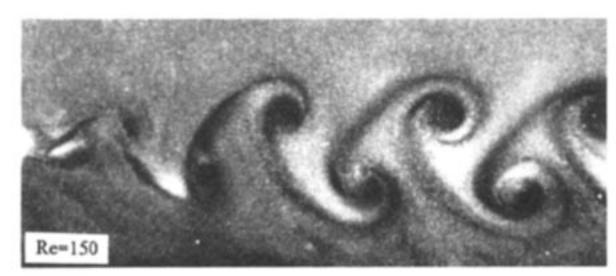

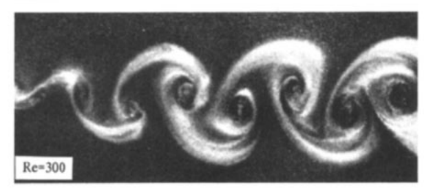

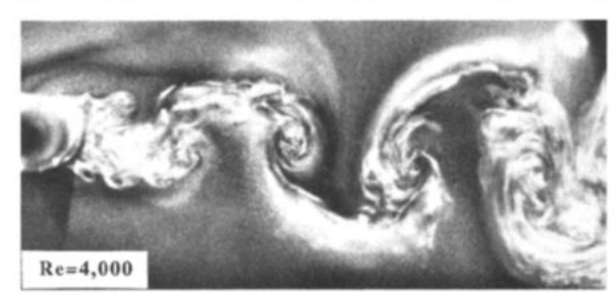

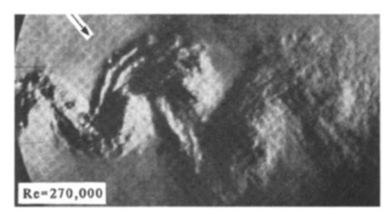

Figure I Visualization of laminar and turbulent vortex streets. These photographs show the development of Karman vortex streets over a wide range of Re. Streamwise vorticity, in the braid between **Karman** vortices, is indicated **by** the white regions and is visible for Re = 300 up to the highest Re = 270,000. The aluminum flake visualizations **are** from Williamson (1995a). The Schlieren photograph at Re = 270,000 is from Thomann (1959).

<!-- page 5 -->

vortex streets are generated at the body in the first place, but they do suggest why, if such a configuration is indeed formed, we should see such a street for reasonable distances downstream: The growth rates of instabilities for typical vortex arrangements are only small. Some descriptive understanding of nearwake vortex formation comes from Gerrard **(1966)** and from Perry et a1 **(1982).**  Gerrard suggested that a forming vortex draws the shear layer (of opposite sign) from the other side of the wake across the wake center line, eventually cutting off the supply of vorticity to the growing vortex. To some extent this process can be understood from the instantaneous-streamline patterns drawn by Perry et a1 **(1982),** shown in Figure 2. At the start of motion, the wake cavity contains a symmetrical pair of equal and opposite recirculating-flow regions on either side of the wake (as shown schematically in Figure **44.** However, when the vortices begin to shed, this cavity opens and instantaneous "alleyways" of fluid penetrate the cavity. To relate this process with Gerrard's interpretation, one might imagine that the anticlockwise vortex A is growing in strength from **(a)**  to (4. In sketch **(e),** a saddle point *S* forms at the lower side of the body, which cuts off any new supply of vorticity-bearing fluid to vortex A and instead forms a new vortex at the body.

A great many measurements have been carried out for the bluff body wake, including Strouhal numbers, coefficients of lift and drag, base pressure (i.e. pressure at a point **180** degrees from the front stagnation point), separation points, surface shear stress, wake velocity measurements such **as** mean and fluctuation velocity profiles and Reynolds stresses, and estimates of the length and width of the "vortex formation" region. Such measurements may be found in a number of well-known reviews in the literature including those by Rosenhead **(1953),**  Wille **(1960, 1966),** Morkovin **(1964),** Berger & Wille **(1972),** Oertel(1990), and Coutanceau & Defaye **(1991)** and also in the book by Blevins **(1990).** The emphasis here is not so much to review all such measurements, but rather it is to expose the vortex dynamics phenomena that exist over a large range of Reynolds numbers, keying on only some of the measurements mentioned above. Particularly revealing as a key for such a discussion are the plots of Strouhal number **S** or base pressure coefficient **Cpb as** a function of Reynolds number. In contrast to some of the other parameters of the flow, the base pressure responds sensitively to the changes in flow instabilities and phenomena throughout the Reynolds number range. An incisive overview of the flow regimes was first given in Roshko & Fiszdon **(1969)** and updated recently in Roshko **(1993).**  Both Roshko **(1993)** and Williamson & Roshko **(1990)** found it convenient to refer to a *base* suction *coefJicient* **(-Cpb),** rather than to the base pressure itself. We discuss an overview of such flow regimes in the following section.

<!-- page 6 -->

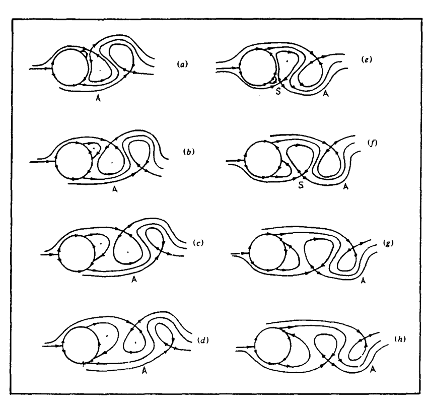

*Figure 2* Model of vortex shedding using topology of instantaneous streamlines. The process of vortex formation from a cylinder has been interpreted in terms of instantaneous streamlines (Perry **et** al **1982).** The birth of each new circulating region is characterized by the formation of a new saddle point in the streamline topology, such **as** the one marked as **S** in sketch (e), where there is also the birth of **a** new anticlockwise circulating region from the lower side of the body.

#### 2. OVERVIEW OF VORTEX SHEDDING REGIMES

In this section, we discuss the various instabilities and flow regimes using, as our basis, the plot of base suction coefficients shown in Figure **3.** This plot, taken from several sources, comes from experiments using a smooth cylinder in good flow quality (turbulence levels typically around 0.1%) and also from the simulations of Henderson (1995). It is known that roughness, turbulence levels (as well as the character **of** turbulence spectra), cylinder aspect ratio, end conditions, and blockage all affect the transitions, although the trends remain the same. The first definition of flow regimes based on measurements of velocity fluctuation, spectra, and frequency was given by Roshko (1954). He

<!-- page 7 -->

found a "stable" (periodic) laminar vortex shedding regime for *Re* = 40-150, a transition regime in the range *Re* = 150-300, with an "irregular" regime for *Re* = 300-10,000+, where velocity fluctuations showed distinct irregularities. Similar regimes were confirmed by Bloor (1964). A surge of recent work has shed further light on phenomena occurring in these regimes and their precise Reynolds number ranges.

Regarding the primary wake instability, a revealing experiment was conducted by Roshko (1955), who studied the effect of a splitter plate (parallel to the free stream) located downstream of a bluff body at high *Re.* He found that, by bringing such a plate closer to the cylinder, he could interfere with the vortex shedding instability within a critical distance from the body, which caused a jump decrease in both the shedding frequency and base suction. A

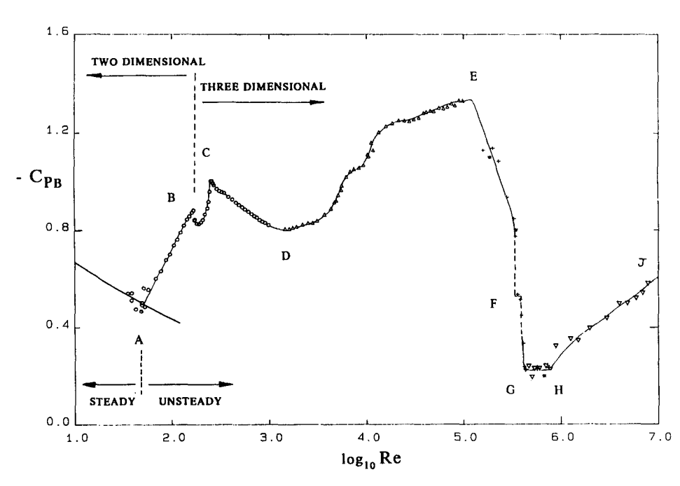

*Figure* **3** Plot of base suction coefficients **(-Cpb)** over a large range of Reynolds numbers. A plot of base suction coefficient is particularly useful **as** a basis for discussion of the various flow regimes. The base suction coefficient (negative of base pressure coefficient) is surprisingly sensitive to the process of vortex formation in the near wake, which itself is affected strongly by the evolution of various 2- and 3-D wake instabilities, **as** Reynolds numbers are varied. Data: *0,* Williamson & Roshko **(1990);** A, Norberg **(1987);** +, Bearman **(1969);** \*, Flaschbart **(1932);** v, Shih et **al(1992).**  Curve for steady flow regime (Re < **49)** is from steady computations of Henderson **(1995).**

<!-- page 8 -->

downstream shift of the low-pressure vortices reduced the suction near the base of the cylinder. The ensuing wider and longer "vortex formation" region exhibits a lower shedding frequency (roughly, the frequency scales inversely with the length of the formation region for a given body). One may define a vortex "formation length" (as in, for example, Bearman **1965,** Griffin & Ramberg **1974;** see the discussion in Griffin **1995)** as that point downstream of the body where the velocity fluctuation level has grown to a maximum (and thereafter decays downstream), as shown schematically in Figure **4d.** Bearman **(1965),**  also using splitter-plate wake interference, made the discovery that the base suction was very closely inversely proportional to the formation length, an **as**sumption often invoked in subsequent studies. It has generally been found in these studies that an increase in formation length *LF/D* is associated with a decrease in the level of velocity fluctuation maximum *u-/ U,* (or Reynolds stress maximum) and a decrease in the base suction, which is consistent with the pioneering splitter-plate experiment of Roshko **(1955).**

It is relevant also, in the discussion of the vortex-shedding regimes, to consider that if one averages over large time (compared to the shedding period) one can define a **mean recirculation region** in the wake, which is symmetric and closed, as sketched in Figure **4c.** This was discussed in Roshko & Fiszdon **(1969)** and in Roshko **(1993),** where the recirculation "bubb1e"for a wake with a splitter plate was related to the theoretical "free-streamline" or "cavity" models. Employing the concept that the pressure and shear stresses on the recirculation bubble are in equilibrium (Sychev **1982),** Roshko derived **an** expression for the bubble length *LB* in terms of the base suction coefficient **-Cpb** and Reynolds shear stress *pu"* for the case of a flat plate normal to the flow (plus splitter plate downstream). He found good agreement with experiments for *LB/ D* and **-Cpb**  and then used these values in the free-streamline model to predict a reasonable value for the drag coefficient. As discussed by Roshko, it is difficult to extend the model to a wake without a splitter plate that experiences vortex shedding, because of the arbitrary nature of choosing some of the parameters. The study by Roshko is important here in that it highlights the link between base suction, the Reynolds stresses, and the wake formation length, which are discussed often in this section. Referring now to the plot of base suction coefficient vs **Re**  in Figure **3,** and following the lead of Roshko **(1993),** we define the various shedding regimes with respect to the letters marked on this plot. We briefly discuss the various vortex dynamics phenomena for each regime by referring also to the sketch in Figure *5.*

#### *Regime up to* **A:** *Laminar Steady Regime (Re* < 49)

At **Re** below around **49,** the wake comprises a steady recirculation region of two symmetrically placed vortices on each side of the wake, **as** shown in Figure **4a,**

<!-- page 9 -->

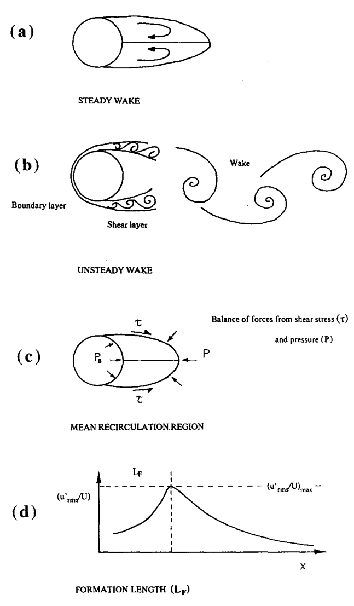

*Figure 4* Some regions and definitions for a cylinder wake. The vortical wake from a bluff body can be steady, at sufficiently low Reynolds numbers as sketched in (a), forming a pair of recirculation regions behind the body. At higher Reynolds numbers, the wake becomes unsteady, usually forming a vortex street, **as** sketched in (b). However, there exists a mean recirculating region in *(c),* even in the case when vortices **are** shedding. A measure of the length of such a region **behind** a body is given by the formation length *LF,* which is (usually) defined by the distance downstream from the cylinder axis to a point where the rms velocity fluctuations are maximized on the wake center line, as sketched in **(4.**

<!-- page 10 -->

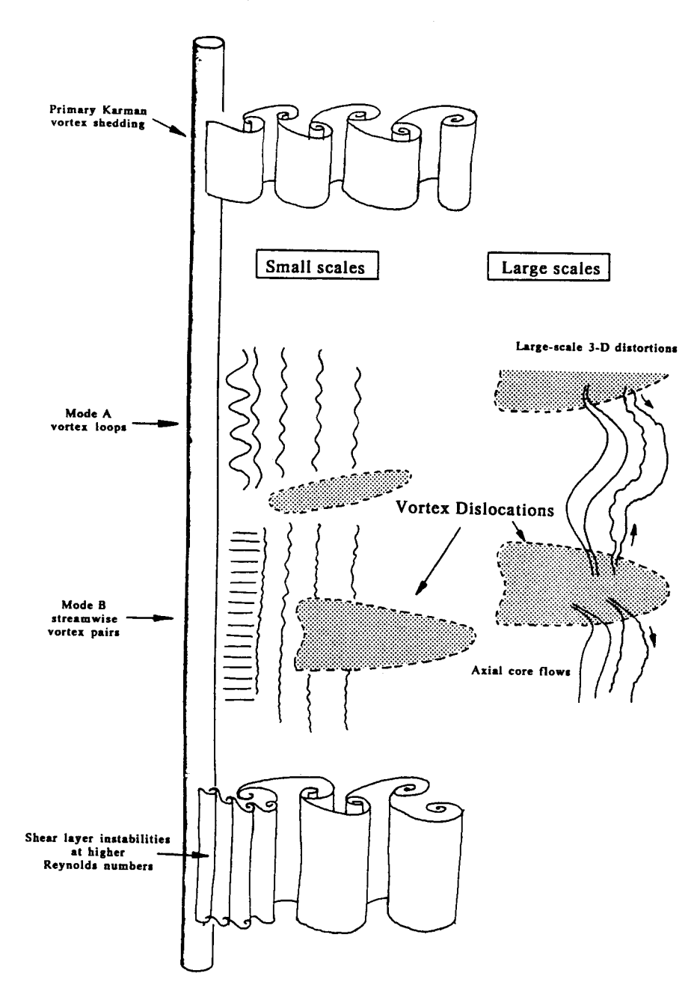

<!-- page 11 -->

whose length grows as the Reynolds number increases. This trend has been shown experimentally by Taneda (1956), Gerrard (1978), and Coutanceau & Bouard (1977), and is supported by the computations of Dennis & Chang (1970). However, from analysis and computation in (constrained to be) steady 2-D flow, it has proven surprisingly difficult to define the variation of bubble shape with Reynolds number, as *Re* becomes large (see Fornberg 1985), and this point is discussed in Roshko (1993). It appears that the asymptotic formula for *CD(Re)* for this steady wake is not yet available. It should be noted that as the length of the steady wake bubble increases, due to the viscous stresses, the base suction is found to decrease **[DNS** of Henderson (1995); experiments of Thom (1933)l. This is a similar trend to that found for the mean wake bubble in the unsteady flow case, as noted below.

## *Regime A-B: Laminar Vortex Shedding*

## *Regime (Re* = *49 to 140-194)*

In this regime, the variation of base suction with *Re* shows a sharp deviation in trend from the steady wake regime above (see Henderson 1995). The recirculation region develops instabilities, initially from the downstream end of the bubble, whose strength and amplification grow with *Re.* This effect may be measured by a monotonic increase in the amplitude of maximum wake velocity fluctuations with *Re* and a gradual movement of the instability maximum (or formation length) upstream toward the cylinder (Williamson 1995a). The onset of the wake instability near *Re* = 49 has been found to be a manifestation of a Hopf bifurcation, and the flow represents a dynamical system described by a Stuart-Landau equation (Provansal et al1987). **As** the wake instability becomes amplified, the Reynolds stresses in the near-wake region increase, the formation length decreases, and there is a consistent increase in the base suction. There is also **an** increase in the unsteady forces, **as** shown from computations (Henderson 1994, 1995; 0 Kedar & GE Karniadakis, private communication, 1993), but not as yet detected in experiment at these low *Re.* The wake oscillations are purely periodic over this complete regime if care is taken to manipulate the (spanwise) end boundary conditions such that the vortex shedding is parallel to the cylinder axis, in a parallel shedding mode. The upper limit of this laminar shedding

*Figure* **5 Instabilities involved in the development of turbulence in the wake. As the Reynolds numbers are increased (down the page), the development of wake turbulence is characterized by the following principal instabilities:** *(a)* **the formation of primary Karman vortices,** *(b)* **the inception of small-scale streamwise vortex structures (modes A and B), (c) the formation of very large-scale 3-D structures, now known as vortex dislocations, and (d) the development of shear-layer instability vortices, which are themselves prone to 3-D instability of small scale.**

<!-- page 12 -->

range has an enormous spread in the literature, *Re* = 140 up to 194, although recent precise results now place the critical Reynolds number very close to 194.

# *Regime B-C: 3-0 Wake-Transition Regime (Re* - *190 to 260)*

This transition regime is associated with two discontinuous changes in the wake formation as *Re* is increased. The discontinuities may be manifested by the variation in Strouhal number as the Reynolds number is increased (Williamson 1988b), or by the change in base suction (Williamson & Roshko 1990) as shown in Figure 3. At the first discontinuity near *Re* = 180-194 (depending on experimental conditions), we see the inception of vortex loops (in a mode A instability) and the formation of streamwise vortex pairs due to the deformation of primary vortices as they are shed, at a wavelength of around 3-4 diameters. This discontinuity is hysteretic and is labeled **as** a "hard" transition by Zhang et a1 (1995). At the second discontinuous change in the *S-Re* relation, there is a gradual transfer of energy from mode A shedding to a mode B shedding over a range of *Re* from 230 to 250. The latter mode comprises finer-scale streamwise vortices, with a spanwise length scale of around one diameter. The large intermittent low-frequency wake velocity fluctuations, originally monitored by Roshko (1954) and then by Bloor (1964), have been shown to be due to the presence of large-scale spot-like "vortex dislocations" in this transition regime (Williamson 1992a). These are caused by local shedding-phase dislocations along the span. The small-scale modes and large-scale dislocations are shown together in the schematic diagram of Figure *5,* indicating the instabilities involved in the evolving wake turbulence. The base suction and Strouhal frequency continue to increase in this regime, but follow curves at a lower level than may be extrapolated from the laminar shedding regime.

#### *Regime C-D: Increasing Disorder in the Fine-Scale Three Dimensionalities*

The peak in base suction close to C, at *Re* = 260, is associated with a peak in Reynolds stresses in the near wake and a particularly ordered 3-D streamwise vortex structure in the near wake (Williamson 1995a). At this point, the primary wake instability behaves remarkably like the laminar shedding mode, with the exception of the presence of the fine-scale streamwise vortex structure, and it has been suggested that the apparent "resonance" at *Re* = 260 is due to shear layer-wake interactions (Williamson 1995a, Prasad & Williamson 1995). As *Re* is then increased towards point D in the plot, the fine-scale three dimensionality becomes increasingly disordered, and this appears to cause a reduction in the two-dimensional Reynolds stresses, a consistent reduction in base suction, and an increasing length of the formation region (Una1 & Rockwell 1988, Williamson 1995a).

<!-- page 13 -->

#### *Regime D-E: Shear-Layer Transition Regime (Re* = *1,000* to 200,000)

In the shear layer transition regime, the base suction increases again (accurately shown in Norberg **1994),** the 2-D Reynolds stress level increases, the Strouhal number gradually decreases (Norberg **1994),** and the formation length of the mean recirculation region decreases (Schiller & Linke **1933),** all of which are again consistent variations. These trends are caused by the developing instability of the separating shear layers from the sides of the body. As Roshko **(1993)** notes, this might be called the "Schiller-Linke" regime, after those who discovered it and who associated this regime with an increase in base suction and drag, while the turbulent transition point in the separating shear layers moves upstream, as *Re* increases. The increase in formation length that we saw in the previous regime **C-D,** and the decrease in formation length in the present regime, are very well demonstrated by the visualizations of Una1 & Rockwell **(1988)** and the PIV **(Particle-Image-Velocimetry)** experiments of Lin et a1 **(1995a),** shown in Figure **6.** Bloor **(1964)** found that the instability vortices appearing in the shear layers generate frequencies in the wake that varied roughly as *Re3I2,* rather than as *Re* (approximately) for the Karman vortices. The Kelvin-Helmholtz instability of the shear layers is principally two dimensional **as** for a free shear layer (Braza et a1 **1986)** and contributes to the rise of 2-D Reynolds stresses and thereby the rise in base suction. Threedimensional structures on the scale of the shear layer vortices are expected to develop in this regime (Wei & Smith **1986,** Williamson et a1 **1995)** as well as three dimensionality on the scale of the Karman vortices.

#### *Regime E-G: Asymmetric Reattachment Regime (or Critical Transition)*

In this regime, the base suction and the drag decrease drastically, and this is associated with a separation-reattachment bubble causing the revitalized boundary layer to separate much further downstream (at the **140"** line) and with a much reduced width of downstream wake than for the laminar case. There is a most interesting phenomenon that occurs at point F in Figure **3,** which corresponds to a separation-reattachment bubble on only one side of the body, as discovered by Bearman **(1969),** and shown by Schewe **(1983)** to be bistable, causing rather large mean lift forces **(CL** = **1).**

#### *Regime G-H: Symmetric Reattachment Regime (or Supercritical Regime)*

In the supercritical regime, the flow is symmetric with two separation-reattachment bubbles, one on each side of the body. Some fluctuations are detected

<!-- page 14 -->

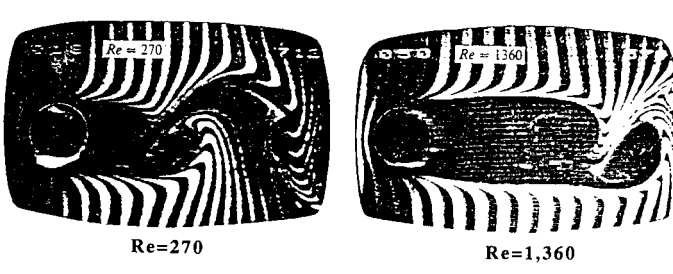

Regime C-D. Lengthening of formation region.

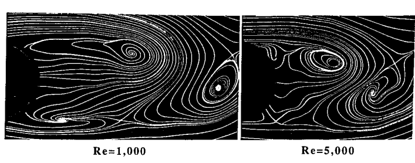

Regime D-E. "Shear layer transition" regime: shortening of formation region.

Figure 6 Variation of vortex formation length with Reynolds number. The variation of vortex formation length, **as** Reynolds numbers are varied, is well exhibited by these hydrogen-bubble and PIV visualizations. (Photographs from Unal & Rockwell 1988; PIV vorticity plots from Lin et a1 1995a.) The pronounced increase of formation length, **as** Re increases from around 300 to 1500, corresponds with a reduction in base suction in regime C-D of Figure 3. Thereafter, the reduction of formation length as Re increases to 5,000 and higher corresponds with an increase of base suction indicated by regime **D-E** of Figure 3.

in the wake at large Strouhal numbers of around **0.4** (Bearman **1969),** which is consistent with the relatively thin wake in this regime (one expects that the frequency will roughly scale inversely with the wake width). According to Roshko **(1993),** the considerably higher Reynolds stresses of the boundary layer following the separation bubble allow the boundary layer to survive a greater adverse pressure gradient than in the post-critical regime (below), where transition finally occurs before separation.

#### *Regime H-J: Boundary-Layer Transition Regime (or Post-Critical Regime)*

The increase in Reynolds numbers, through the various regimes, to this point is associated with a sequence of fundamental shear flow instabilities, following

<!-- page 15 -->

#### the order

wake transition,

shear layer transition,

boundary layer transition.

The effect of an increase in *Re* up to this particular regime (H-J) is to move the turbulent transition point further upstream, until at high enough *Re,* the boundary layer on the surface of the cylinder itself becomes turbulent. It was generally assumed that, after this point, the downstream wake would be fully turbulent, and it was not expected that coherent vortices would be observed. However, in **1961,** Roshko was able to demonstrate the surprising result that periodic vortex shedding is strongly in evidence even in this flow regime. Separation occurs further upstream, yielding higher drag and base suction and a wider downstream wake than in the previous regime.

#### **3. THREE-DIMENSIONAL VORTEX PATTERNS IN THE LAMINAR SHEDDING REGIME**

In this section, we discuss vortex dynamics in the laminar shedding regime, including not only a number of new experimental discoveries, but also a rather brief description of analytical approaches to vortex shedding, involving stability theory and also the interpretation of the flow in the framework of a dynamical system using the Stuart-Landau model.

#### 3.1 *The Onset of Vortex Shedding: Hopf Bifurcation and Absolute Instability*

The laminar steady regime is associated with a recirculation region downstream of the body, comprising a pair of symmetrically placed vortical regions on each side of the wake, as sketched in Figure *4a.* **As** one increases the Reynolds number within this regime, it appears, from the experimental work of Taneda **(1956)** and Gerrard **(1978),** that the inception of wake instability is associated with the formation of what Gerrard terms "gathers" or sinuous waves traveling downstream on the sides of the recirculation region. From velocity measurements, this is associated with a rather sudden inception and growth in amplitude of wake fluctuations, as one increases flow velocity.

Recently there has been a strong interest in establishing a link between vortex shedding and stability theory, concentrating on the role of absolute instability. Over the past decade, the concepts of local absolute and convective instabilities have been found useful in shear flows. The early ideas about a possible

<!-- page 16 -->

connection between local absolute instability (for example, Koch 1985) and self-excited global oscillations of the entire near wake have been refined in a number of papers (for example, Triantafyllou et a1 1986, Monkewitz & Nguyen 1987, Chomaz et a1 1988, Monkewitz 1988, Plaschko et a1 1993). In physical terms, the instability characteristics of a flow are determined by the behavior of its impulse response. If an impulsively generated, small-amplitude transient grows exponentially in place, i.e. at the location of its generation, the flow is termed *absolutely* unstable. If, on the other hand, the transient or wave packet is convected downstream and ultimately leaves the flow at the location of its generation undisturbed, one refers to *convective* instability. An excellent comprehensive review concerned with such instabilities in shear flows is given in Huerre & Monkewitz (1990).

These theoretical ideas received strong impetus following a milestone transient experiment by a group in Marseille (Mathis et a1 1984, Provansal et a1 1987), which showed that Karman vortex shedding at low Reynolds numbers is indeed a self-excited limit-cycle oscillation of the near wake, resulting from a time-amplified global instability. Further experiments of this type have been conducted by Sreenivasan et a1 (1986) and Schumm et a1 (1994), among others. Provansal et a1 (1987) found that the periodic vortex street in the near wake is the saturated end product of a temporal global wake instability. They also found that, for *Re* not too far above the critical Reynolds number *(Re&,*  the shedding frequency in the final saturated state is not significantly different from the linear global response frequency, suggesting that an approach to vortex shedding from linear instability theory has validity. In their studies, Provansal et a1 used a Stuart-Landau nonlinear model equation for the amplitude of wake oscillations. The equation, for complex amplitude has the form

| $dA/dt = \sigma A - \lambda A ^2A$ | (1) |
|------------------------------------|-----|
|------------------------------------|-----|

for complex coefficients *B* and A, which yields an amplitude equation and a phase equation. The model has applicability if the onset of vortex shedding at the critical Reynolds number behaves as a Hopf bifurcation, where *a,* is the bifurcation parameter, and can be expanded in powers of *(Re* - *Re,",).* If one searches for a steady state amplitude solution (where *dlAl/dt* = 0) in the above equation and uses the leading linear term a, - *(Re* - *Re,,it),* one arrives at a limit cycle amplitude,

| $A = \text{constant} \times (Re - Re_{\text{crit}})^{1/2}$ | (2) |
|------------------------------------------------------------|-----|
|------------------------------------------------------------|-----|

Provansal et a1 found that this relationship was matched in their vortex shedding experiments to good accuracy. From further transient experiments involving an impulse response, Provansal et a1 were able to find values for the coefficients

<!-- page 17 -->

in the above equations, and they confirmed for both subcritical and supercritical Reynolds numbers that the time evolution of the amplitude matched the predictions from the Stuart-Landau model. It appears that the Stuart-Landau equation is well adapted to describe the behavior not only beyond the threshold of vortex shedding in the wake, but also below, when the system is subjected to forced excitation. Schumm et a1 (1994) provide an overview of the most recent developments in such analyses.

#### **3.2** *Oblique and Parallel Modes of Vortex Shedding*

Until eight years ago, only a few (sporadic) observations and measurements had been made that showed or suggested that vortices can shed at some oblique angle to the axis of the cylinder in what we now term oblique shedding. Some of these early measurements are discussed in the review by Berger & Wille (1972); typical oblique angles of 15-20' were found. An example of slantwise shedding was photographed by Berger (1964), using smoke in a wind tunnel, although contrary observations by Hama (1957), who used a towing tank, demonstrated only parallel shedding. Several pages of the review paper of Berger & Wille (1972) are given over to discussion of slantwise **vs** parallel shedding, but the matter was not resolved.

A further phenomenon, which we show to be directly related to the above, is the phenomenon of discontinuities in the relationship between Strouhal number and Reynolds number in the laminar shedding regime. These were first detected very clearly by Tritton (1959) near *Re* = 75 and have subsequently been the source of a great deal of debate over a period of 30 years, beginning with a **se**ries of papers by Tritton and Gaster (Gaster 1969, Tritton 1971, Gaster 1971). Some idea of the ensuing scatter among experimental measurements of Strouhal frequency over the period 1878-1978 is given in a plot adapted from Gerrard (1978) in Figure 7a, showing scatter of the order of 20% even among the modern experiments. This scatter was present despite the fact, as pointed out by Roshko (1989), that "the quantities involved *(V,* D, *u,* and *f)* could berather easily measured to better than 1 % accuracy." *(u* is the kinematic viscosity.) Many explanations were put forward over the years: Different modes of vortex shedding have been attributed to different forms of 2-D wake instability (Tritton 1959), to shear in the oncoming free stream (Gaster 1971), to differences in free-stream turbulence (Berger & Wille 1972), to changes in the influence of vorticity diffusion in the near wake (Gerrard 1978), and more recently to a scenario involving a "route to chaos" in the cylinder wake (Sreenivasan 1985). Van Atta & Gharib (1987) offered a convincing case that flow-induced vibration could cause discontinuities in the S- *Re* relation, and their meticulous work was subsequently supported by the computations of Karniadakis & Triantafyllou (1989). However, it has now been shown that, in the absence of certain effects, such as free-stream shear

<!-- page 18 -->

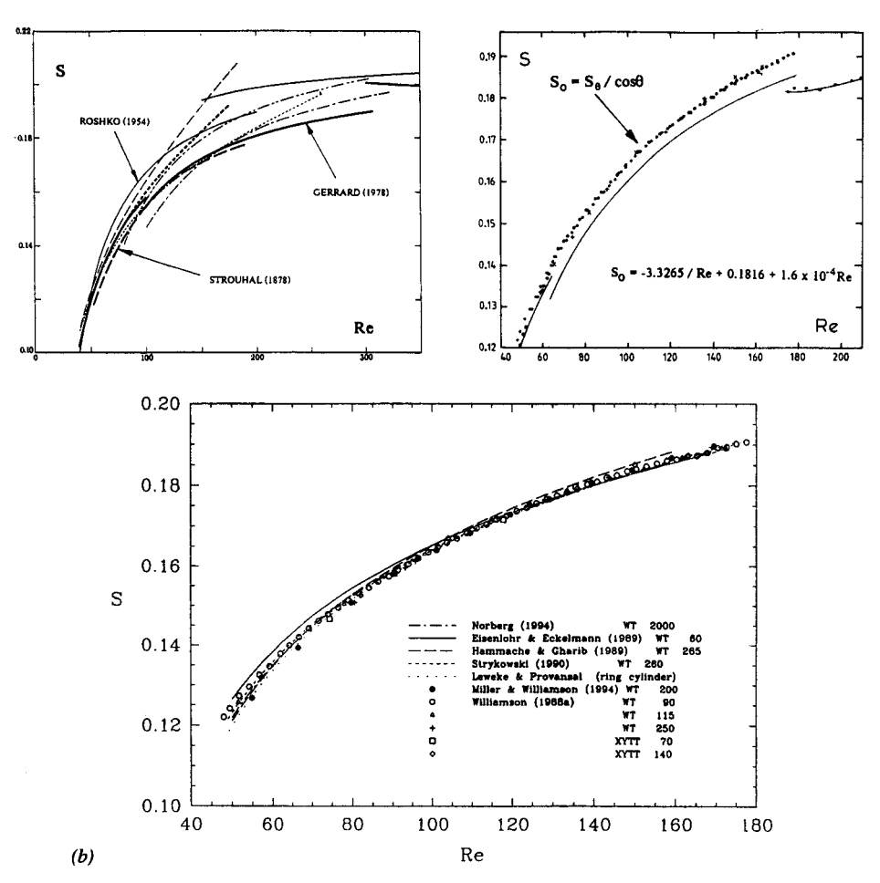

Figure **7** Strouhal-Reynolds number relationship (1878-1978). (a) Over a period of 100 years, beginning with the vortex kquency measurements of Strouhal (1878), there has existed of the order of 20% disparity among the many measurements of Strouhal number vs Reynolds number, in the laminar shedding regime (tabulated data collected by Gerrard 1978). The (more recent) right-hand plot shows the single S-Re curve relevant **to** parallel shedding. The curve is universal in the sense that one can collapse oblique-shedding data onto **this** single curve using a cos **0** relation (Williamson 1988a). (b) Agreement to the 1% level of S-Re relationship for laminar parallel shedding using different techniques. WT wind tunnel facility; **XYTT:** a water facility known as the **XY** Towing Tank. The numbers indicate 1engWdiameter ratio *(LID).*

<!-- page 19 -->

and cylinder vibration, a discontinuity in the S- Re relation can be caused by the unexplained phenomenon described earlier, namely oblique shedding.

The S- Re discontinuity, originally observed by Tritton (1959), has been found to be caused by a changeover from one mode of oblique shedding to another oblique mode, as Re is increased (Williamson 1988a, 1989; Eisenlohr & Eckelmann 1989; Konig et a1 1990; Hammache & Gharib 1989,1991; Lee & Budwig 1991; and others). The particular boundary conditions at the spanwise ends of the cylinder dictate the angle of shedding over the whole span, even for a cylinder that is hundreds of diameters in length, by what is termed indirect influence (Williamson 1989). Gerich & Eckelmann (1982) had earlier shown that a region close to the ends of a cylinder (about 10 diameters in length) can be influenced in a direct manner, causing a cell of lower frequency shedding to appear near the ends. It is this end cell that gave rise to the "knots" of turbulence discussed by Slaouti & Gerard (1981).

In towing tank and wind tunnel experiments, Williamson (1988a, 1989) found that the oblique vortices formed a periodic chevron pattern as shown in Figure 8a. Over each half span, the oblique angle is dictated by the end conditions in that half. For the Strouhal number discontinuity below a critical Re (= 64), a quasi-periodic pattern may be found, which is caused by the presence of a further cell of higher frequency appearing in the central span region (Williamson 1988a, Konig et a1 1990). The shedding assumes a cellular structure, with different frequencies coexisting at different spanwise locations and vortex dislocations (Williamson 1989) or vortex splitting (Eisenlohr & Eckelmann 1989) occurring at the cell boundaries because vortices on each side move in and out of phase with each other. A clear example of three coexisting cells is shown in the smoke visualization of Figure 8b, taken from Konig et a1 (1992). It has been suggested, from the analyses of Albarede & Monkewitz (1992) and Park & Redekopp (199 1) as well as from the experiments of Miller & Williamson (1994), that the cellular shedding patterns-and the breakdown along the span of an oblique shedding angle if it is too large-is an example of the Eckhaus type of instability. This possibility seems firmly established in a very interesting and related study of the case of the ring-cylinder (torus) (Leweke et al 1993, Leweke & Provansal 1995). Finally, the above experiments in Williamson (1989) also reconcile the earlier differences between the experiments of Berger (1964) and Hama (1957). Early in a run, the shedding is parallel, which corresponds to Hama's towing-tank case, whereas later in a run, the oblique shedding region spreads across the span from the ends (behind a phase shock), corresponding to Berger's wind-tunnel case.

Judging from the above, one might question whether it is possible to manipulate the end conditions to promote parallel shedding. Indeed, we now know that

<!-- page 20 -->

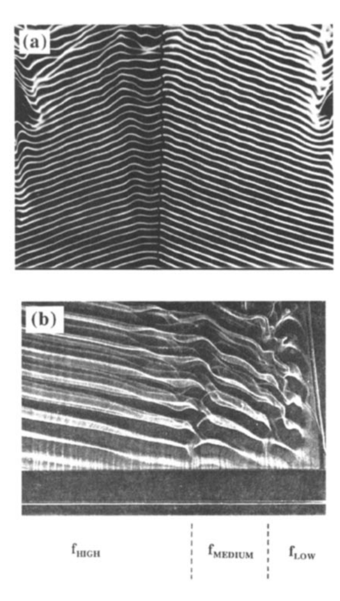

*Figure 8* **Oblique vortex shedding, induced by end (spanwise) boundary conditions.** *(a)* **The chevron pattern** of **oblique shedding.** *Re* = **90. (From Williamson 1988a.)** *(b)* **Visualization** of **cellular shedding.** *Re* = **75. (From Koenig et a1 1992.) In each picture, flow is upwards past a horizontal cylinder.**

<!-- page 21 -->

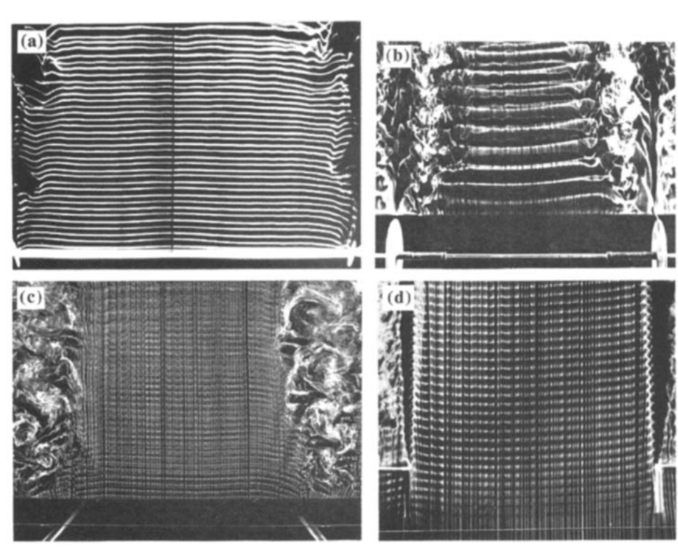

*Figure* **9 Parallel** (2-D) **vortex shedding, induced by various techniques** to **manipulate end bound***ary* **conditions. (a) Using angled endplates. (From Williamson 1988a.)** *(b)* **Using coaxial end cylinders. (From Eisenlohr** & **Eckelmann 1989.) (c) Using novel control cylinders (orthogonal to test cylinder). (From Hammache** & **Gharib 1991.)** (d) **Using suction tubes** from **downstream. (From Miller** & **Williamson 1994.)**

there are several means to achieve parallel shedding, as illustrated by the visualizations of Figure 9, taken from Williamson (1988a), Eisenlohr & Eckelmann (1989), Hammache & Gharib (1991), and from Miller & Williamson (1994). The mechanical devices to achieve parallel shedding (respectively) include angling inwards the leading edge of endplates, ending the span with larger coaxial cylinders, or locating large cylinders normal and upstream of the test cylinder at the ends. It appears that the techniques involve a slight speeding up of the flow near the ends, which is evident in the nonmechanical technique used by Miller & Williamson (1994). In this case, the incident flow near the ends is speeded up by suction tubes placed - 10 diameters downstream at the ends. Surprisingly, a local incident velocity increase of only 1.5% above free stream

<!-- page 22 -->

(at the spanwise ends) can trigger parallel shedding over the whole span. Parallel shedding has also been achieved at very large aspect ratios (length/diameter > 2000) by Norberg (1994), who also finds an increase in incident velocity at the spanwise ends in his experimental arrangement.

One important question concerning oblique shedding is the distribution of vorticity and orientation of the vortex lines. Berger (1964) suggested that the principal vorticity vector lay along the axes of the oblique vortices, suggesting that both spanwise and streamwise vorticity components existed. This point was investigated by Hammache & Gharib (1991), who made detailed measurements of spanwise and streamwise velocity components. By using a simple model based on the ratio of the streamwise to the spanwise vorticity components, they predicted an angle of shedding close to that which was visually observed, suggesting that the vorticity vectors indeed lie along the oblique vortices.

In the context of oblique waves, it is relevant to mention a result that may be derived from Squire's transformation (Squire 1933). One can show (for a given wake profile and Reynolds number, and for a parallel flow) that if the frequency and temporal growth rate of the most unstable two-dimensional wave are respectively fo and **a,,** then for an oblique wave at angle 8, the most unstable frequency fe is given by fe = *fo* cos 8 and similarly that the growth rate a0 is given by as = **a,** cos **0.** From such theoretical considerations, Garry Brown suggested (private communication, 1988) that the cylinder wake frequencies may follow the same trend. With parallel shedding, the Strouhal-Reynolds number curve is completely continuous, as shown in Figure 7. Williamson (1988a) has shown that one may define a universal Strouhal curve, in the sense that the experimental oblique-shedding data **(So)** can be closely collapsed onto the parallel-shedding curve (So) by the transformation

| $S_0 = S_\theta / \cos \theta.$ | (3) |
|---------------------------------|-----|
|---------------------------------|-----|

The dependence of shedding frequency on the phenomenon of oblique shedding would explain at least some of the significant scatter found in the many measurements of Strouhal number, illustrated earlier in Figure *7a.* Since 1988, many groups have measured the S- *Re* relationship in the laminar regime, and the agreement among the laboratories is remarkably close, as shown in Figure *7b,*  to the 1% level. These data include both water and air facilities, as well as a very large range of aspect ratio (60-2000).

Experimentally, the cosine law of Equation (3) has been closely confirmed in several papers (e.g. Konig et a1 1990, 1993; Miller & Williamson 1994, Leweke & Provansal 1995), and it may be derived approximately from the analytical models of Triantafyllou (1992) and Albarede & Monkewitz (1992). In the experiments of Miller &Williamson, the end-suction technique allowed a continuous control of the oblique shedding angle between 0 and 23". However,

<!-- page 23 -->

a revealing set of experiments by the Gottingen group (Konig et a1 1993, Brede et a1 1994) suggests that only discrete values of the shedding angles may exist naturally in the cylinder wake. The Strouhal curves for these different modes lie along only four unique curves in the S-Re plane. Brede et a1 state that "the discreteness of the shedding modes is independent of the end conditions of the cylinder, but is an intrinsic feature of the vortex shedding behind an infinite long cylinder." However, Leweke & Provansal (1995) suggest that a continuum of angles should be found, and that any discrete-angle modes are due to end effects. Further work to investigate this continuum vs discrete paradox is needed.

## 3.3 *3-0 Phase Dynamics*

Associated with the recent surge of experimental discoveries of 3-D shedding patterns in the cylinder wake, there have been a number of fruitful analytical approaches to modeling both the steady state and transient 3-D shedding patterns, involving oblique or parallel shedding, chevron patterns, cellular shedding and vortex dislocations, and phase shocks and phase expansions (to be described in this section). Triantafyllou (1992) considered the problems of slow spanwise modulations and inhomogeneities, using amplitude or modulation equations, in close analogy with the description of patterns in convection boxes. Noack et al(1991) modeled the wake using van der Pol oscillators with diffusive spanwise coupling. The group at Marseille (Albarede et al 1990) used diffusively coupled Stuart-Landau oscillators along the span. The resulting equation is a Ginzburg-Landau (G-L) equation in time and spanwise coordinate:

$$\frac{\partial A}{\partial t} = \sigma A - \lambda |A|^2 A + \mu \frac{\partial^2 A}{\partial z^2}, \quad (4)$$

where the coefficients are evaluated experimentally. The chevron pattern (Williamson 1989) is well modeled by this approach, **as** are the qualitative dynamics of "shocks" in the phase distribution (or phase shocks). Other complementary papers have appeared by Park & Redekopp (1991) and Chiffaudel (1992), who use a 2-D G-L equation. Park & Redekopp find that as the oblique angle increases, under certain conditions, the local absolute growth rate is diminished until an integral for the absolute growth rate over the complete span falls below a critical value. At this point, vortex dislocations appear in the analysis, in accordance with the experimental results of Williamson (1989). Related to the above, Albarede & Provansal(l995) have shown, using the G-L model, that the chevron pattern is unstable for Re -= Rew, where Rew = 64 is the value found in Williamson (1988a) below which the chevron breaks down to cellular shedding. A further approach has been adopted by Lefrancois & Ahlborn (1994), who simply utilize optics equations in a Huygens-type wave process to model wake patterns.

<!-- page 24 -->

Transient patterns have recently been studied in experiment, using a continuously variable suction technique described earlier (Miller & Williamson **1994,**  Williamson & Miller **1994).** The chevron pattern is in fact unstable in that any minutely small difference in (magnitude **of)** oblique shedding angle will cause the apex of the chevron to translate spanwise, until there remains but one orientation of shedding across the span. As discussed by Park & Redekopp **(1991)** and Albarede & Monkewitz **(1992),** the chevron is a "stationary" wave number shock, remaining stationary only under conditions of exact spanwise symmetry. Transient experiments have involved setting up one angle across the complete span and then impulsively changing the end boundary conditions (Miller & Williamson **1994,** Monkewitz et a1 **1995).** These experiments led to two distinct phenomena, as illustrated in Figure **10.** If an oblique angle is

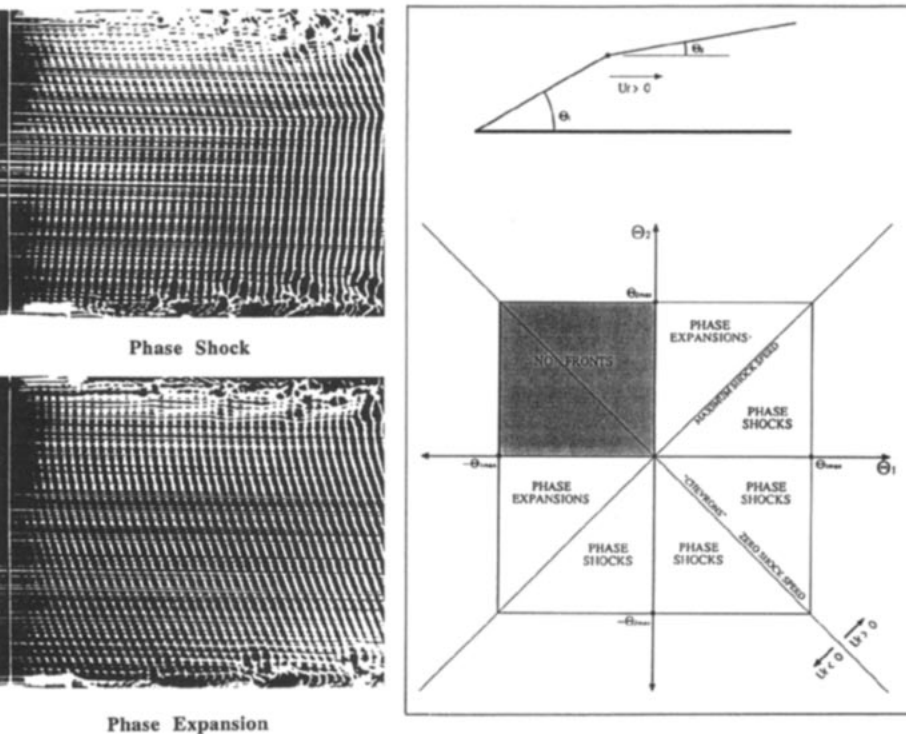

*Figure 10* **3-D** phase dynamics: phase shocks and phase expansions. The phase shock and phase expansion are caused by impulsive changes in the end conditions, using the upper and lower suction tubes (just visible). A map of regions for 3-D phase dynamics phenomena in the **(01,** &) plane is shown to the right, taken from Miller &Williamson (1994). Predictions of these phenomena come from the Ginzburg-Landau equation (Monkewitz et al 1995).

<!-- page 25 -->

generated behind a front that is greater than the angle ahead of the front, then a phase shock is produced. If the oblique angle behind the front is less than the angle ahead of the front, a phase expansion is produced. The present phase expansion and phase shock pattern phenomena are actually predicted from the Ginzburg-Landau equations (Monkewitz et a1 1995), which take the form of a Burgers equation for the spanwise wave number q,

$$\frac{\partial q}{\partial t} = \mu_1 \frac{\partial^2 q}{\partial z^2} - \lambda_1 q \frac{\partial q}{\partial z}, \quad (5)$$

for which (phase) shocks and expansions are solutions. [Interestingly, one can also make reasonable predictions of all these phenomena, based on a constant normal wavelength assumption coming from some direct wavelength measurements (Miller & Williamson 1994).] A map of regions in the plane of oblique angles (ahead of and behind a front) is shown in Figure 10, where one finds conditions for no fronts, phase expansions, or phase shocks, including conditions for zero or maximum shock speed, depending on the two angles. Regarding the above modeling of yet another phenomenon in bluff body wakes by the Ginzburg-Landau model, Monkewitz et a1 state that "this success further deepens the (mathematical) mystery of why such weakly nonlinear amplitude equations work so well . . . far from the control parameter range where they can be justified rationally."

#### **4.** THREE-DIMENSIONAL VORTEX DYNAMICS IN THE TRANSITION **REGIME**

The wake transition regime has had remarkably few investigations in comparison to both the laminar regime and also those regimes at higher Reynolds number involving shear layer and boundary layer transition. Possibly this is because of the sensitivity of this regime to experimental conditions and to the difficulty in determining flow structure because of the intermittent nature of the flow. Nevertheless, recent work shows that this regime is surprisingly rich in vortex dynamics phenomena, both fine-scale and large-scale, which have counterparts in free shear flow (mixing layer) transition.

The transition to three dimensionality in the wake can conveniently be described with reference to the measurements of Strouhal-Reynolds number in Figure 11. Notice that this transition, originally described by Roshko (1954), actually involves two discontinuous changes (Williamson 1988b). At the first discontinuity the Strouhal frequency drops from the laminar curve to one corresponding to a mode A 3-D shedding, at around Re = 180-190. This discontinuity is hysteretic, and the exact *Re,fii,* depends on whether the flow speed is increased or decreased and on the experimental arrangements, as shown below.

<!-- page 26 -->

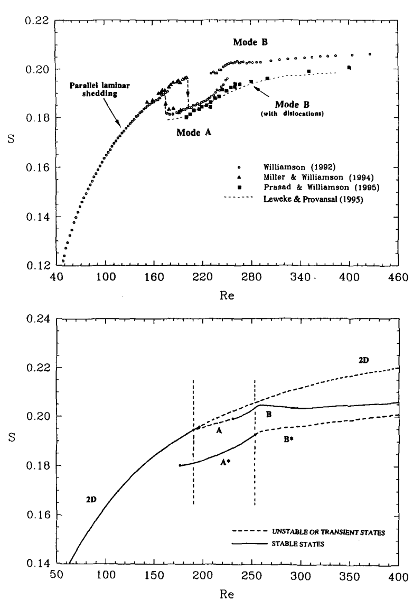

Figure *11* Strouhal-Reynolds number relationship over laminar and **3-D** transition regimes. *(a)*  The transition regime is characterized by two distinct discontinuities in the measured wake parameters, **as** Re is increased, and may be conveniently interpreted with reference to this S-Re plot. *(b)*  A new interpretation of the Strouhal curves; the upper curve corresponds to small-scale instabilities alone (e.g. A, B); the lower one corresponds to these instabilities combined with intermittent vortex dislocations (e.g. A\*, **B\*).** The natural wake transition follows the sequence *(20* + **A\*** -+ B). (Plots from Williamson 1995a.)

<!-- page 27 -->

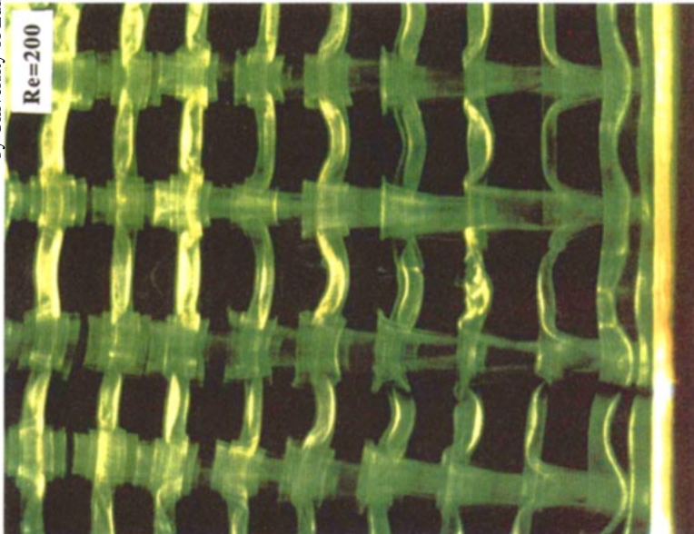

Annu. Rev. Fluid Mech. 1996.28:477-539. Downloaded from [www.annualreviews.org](http://www.annualreviews.org)
by University of Edinburgh on 06/26/12. For personal use only.

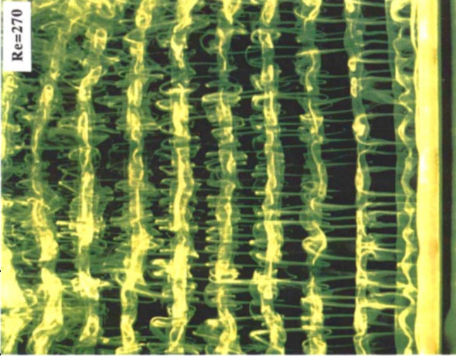

*Figure 13* Modes A and B 3-D instabilities. (a) The left panel shows mode A instability, which is associated with the inception of streamwise vortex loops. This example for  $Re = 200$  corresponds with a spanwise wavelength,  $\lambda/D = 4.01$ , which is remarkably close to the maximum growth rate from Floquet analysis (Barkley & Henderson 1995). (b) The right panel shows mode B instability, which is associated with the formation of finer-scale streamwise vortex pairs.  $\lambda/D$  is roughly 1.0;  $Re = 270$ . Note that both photographs are to the same scale. (From Williamson 1995a.)

<!-- page 28 -->

*Figure 15* Direct numerical simulation of modes **A** and B **3-D** instabilities. The existence of modes **A** and B 3-D instabilities has been found, for the first time, from DNS computations. The surfaces colored yellow and blue mark a particular value of positive and negative vorticity *(03,*  and the red surface marks a value of spanwise vorticity *(w..).* (Plots from Thompson et al 1994.) Similar length scales are being found from the DNS computations of Zhang et a1 (1 995).

<!-- page 29 -->

*Figure* 20 Color visualization of forced two-sided vortex dislocation. **A** two-sided vortcx dislocation is induced to occur at a local spanwise position in the wake by placing a small ring disturbance around the cylinder. The flow is upwards past the horimntal cylinder (at the lower edge). *Re* = 140; *x/D* =I 8 to 60 (vertically). (From Williammn 1992a.)

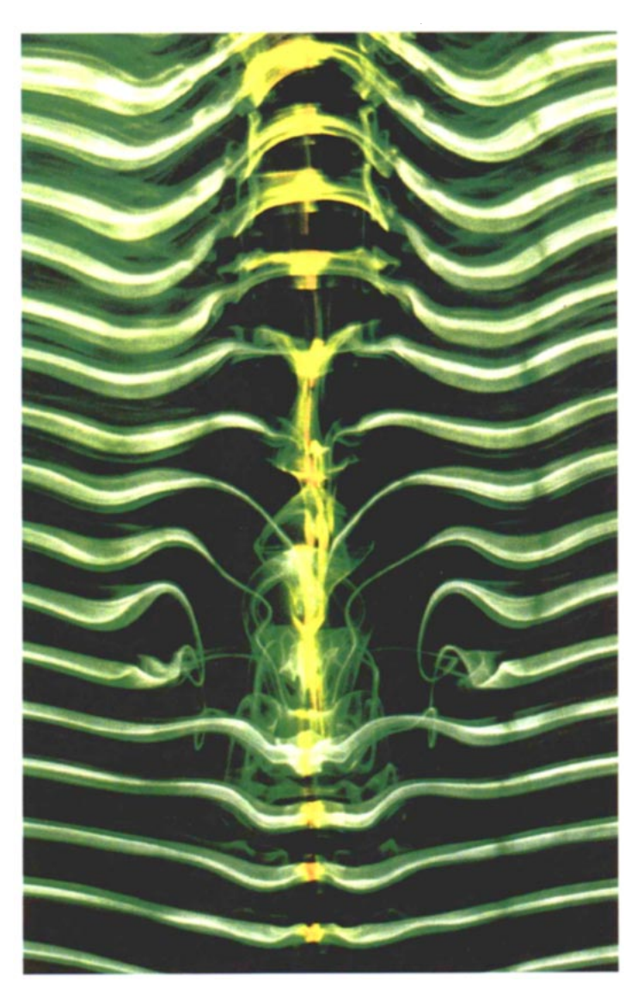

<!-- page 30 -->

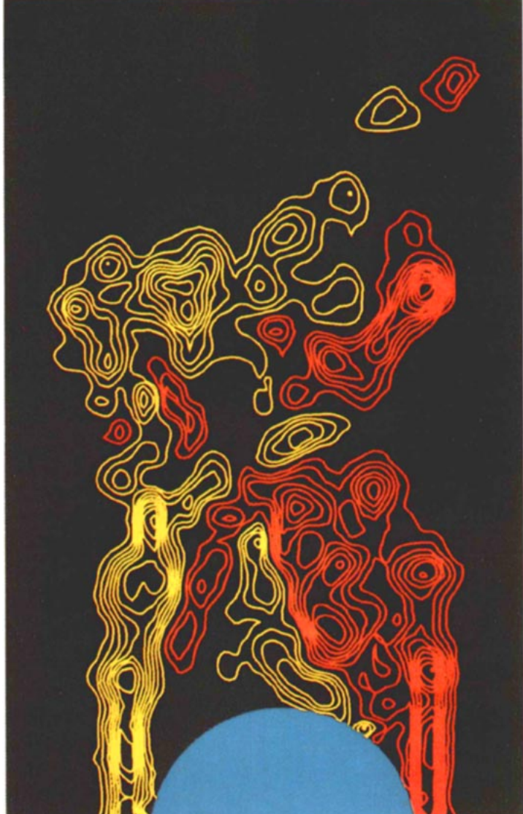

*Figure 22* Shear layer instability vortices: contours of positive (*red*) and negative (*yellow*) spanwise vorticity. PIV measurements of the shear layer vortices, as distinct from the Karman vortices (Lin et al 1995a). This case taken at  $Re = 10,000$  shows that the shear layer vortices amalgamate in the near wake into the primary Karman vortices, before shedding downstream.

<!-- page 31 -->

As *Re* is increased up to 230-260, there is a further discontinuity in Strouhal number, indicating an additional mode B. This discontinuity may be contrasted with the first in that it is not hysteretic, and instead involves a gradual transfer of energy from mode **A** to mode B, as one increases *Re.* Interestingly, in the original S- *Re* data of Roshko (1954), most of his scatter is centered around Reynolds numbers corresponding to these two discontinuities. It is seen later that each of these 3-D shedding modes corresponds to a spanwise instability in the wake.

The definition of such Strouhal discontinuities is only clearly possible if one takes long time averages of the spectra of wake velocity fluctuations. Such spectra are shown in Figure 12, where the first discontinuity in Figure 12a exhibits two possible spectra at the same *Re* due to the hysteresis effect. At the second discontinuity (Figure 12b), the spectra are twin peaked. The lower peak corresponding to mode A gradually gives way to the peak at mode B, as *Re* is increased. This is due to an intermittent swapping between modes, rather than the simultaneous existence of both modes (Williamson 1995a). One might suspect that these two modes are artifacts of the end conditions and are associated with an insufficiently long cylinder (around 200 diameters long in Figure 12b); however, the results of C Norberg (private communication, 1989) shown in Figure 12c for a length/diameter ratio *LID* = 2000 confirms the existence of the two modes A and B at large *LID.*

#### 4.1 *Critical Reynolds Number for Wake Transition*

There is a relatively immense range of experimentally determined critical *Re*  for wake transition *(Re* = 140-190) quoted in the literature. Surprisingly, the origin of these differences has received almost no attention in the literature, except for the study by Bloor (1964) and recent studies by Hammache & Gharib (1989) and Miller & Williamson (1994). Bloor found that *Rec,it* could vary between 140 and 190, depending on the level of free-stream turbulence (0.03-1.0%), although the end conditions are unknown in these experiments. However, it now appears that in a number of facilities, even with essentially the same turbulence level (of order 0.1%), and comparable oblique shedding angles, investigators have nevertheless found a large disparity in Recrit; for example, Roshko (1954) and Tritton (1959) found *Re* = 150, Zhang et a1 (1995) found *Re* = 160, Eisenlohr& Eckelmann (1990) and Norberg (1994) found *Re* = 165, and Williamson (1988a, 1989) found *Re* = 178.

In a related study, Hammache & Gharib (1989) showed that the critical *Re*  for wake transition was increased if, instead of ending their test cylinder span on the sides of the wind tunnel wall, they introduced their control cylinders at the ends of the span to induce parallel shedding. They suggested that transition was triggered early at *Re* = 156 by the fact that the shedding was oblique, rather than parallel, although in changing the oblique angles, they were simultaneously

<!-- page 32 -->

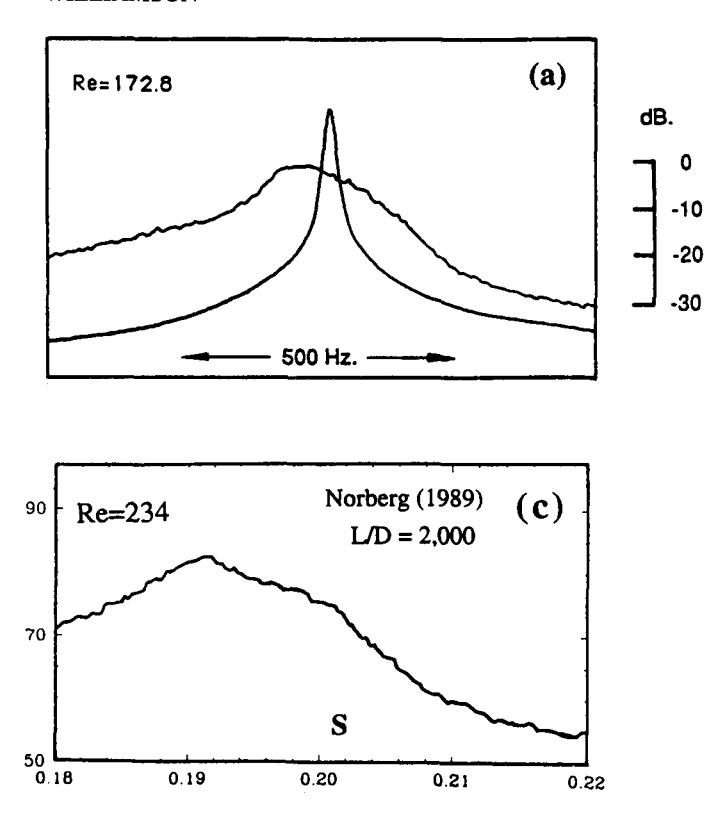

*Figure 12* **Velocity spectra from the near wake in the wake-transition mame.** *(a)* **Spectra at the first discontinuity, showing hysteresis.** *Re* = **172.8;** *L/D* = **200.** *(b)* **Spectra at the second discontinuity, showing gradual transfer of energy from mode A to B, as** *Re* **increases.** *Re* = **207- 318;** *LID* = **200.** *(c)* **Spectra at the second discontinuity, for high aspect ratio,** *LID* = **2000, for**  *Re* = **234.1. Data for** *(a)* **and** *(b)* **from Williamson (1988b). Data for (c) from C Norberg (1989, private communication).**

varying the end conditions. In contrast, Leweke & Provansal **(1995)** have shown, in the wake of a ring cylinder (torus), that the oblique modes have a higher critical *Re* than the parallel modes. Miller & Williamson **(1994)** have found that nonmechanical end conditions (using suction **tubes** downstream of the body) can yield rather "clean" end conditions **as** shown visually in Figure **9d,**  without the large unsteady flow structures at the cylinder spanwise ends as are normally present (see Figure **9a,** for example). The laminar regime for parallel shedding can be extended up to *Recfit* = **194,** as shown in Figure **1 la,** and even beyond *Re* = 200 for short periods of time (transient experiments). One may

<!-- page 33 -->

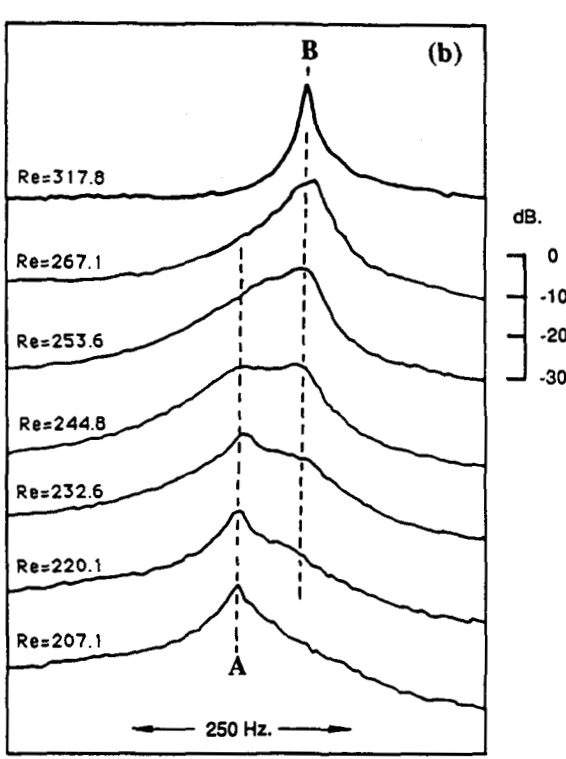

*Figure I2 (continued)*

conclude that transition is triggered early due to end conditions, and, in the absence of other effects, it would appear that end contamination could account for the large scatter in the quoted critical Reynolds numbers for transition, reported over the past forty years. Physically, this contamination takes the form of regions of vortex dislocations moving across the span.

The above conclusions regarding an accurate determination of critical Re from experiment are most timely since analytical studies are, at the present time, predicting Reynolds numbers for wake transition. Noack & Eckelmann (1994) have conducted an approximate analysis, using a low-dimensional Galerkin method (with 100 modes), and find *Recdt* = 170, somewhat below the experimental value of 194. However, Barkley & Henderson (1995) have predicted 3-D instability from their Floquet stability analysis (including 10,000 modes) and find *ReCdt* = **188.5 f** 1.0, which is in excellent agreement with the recent experiments.

<!-- page 34 -->

#### *4.2 Modes A and B Three-Dimensional Instabilities: Small-Scale Structures*

Very few measurements have been made in the transition regime to date, and even fewer flow visualization studies have been done, although some new phenomena in this regime have been discovered in the past few years. Direct numerical simulations are also now contributing strongly to our understanding in this regime (Karniadakis & Triantafylou 1992; Zhang et a1 1995; Henderson 1994, 1995; Mittal & Balachandar 1995a,b,c). Based on his experimental velocity measurements, Roshko (1954) suggested that transition to turbulence existed in the separating shear layers before the vortices were fully formed and shed from the cylinder. High-frequency oscillations were later detected in the separating (and transitioning) shear layers by Bloor (1964). Wei & Smith (1986) observed that secondary vortices were associated with these high-frequency oscillations, and they hypothesized that the 3-D stretching of these secondary vortices causes streamwise vortices to appear in the wake. However, although this scenario **of** shear layer transition is known to occur at *Re* greater than 1000, the brief but significant visualizations of Hama (1957) showed that the instability in the wake transition regime takes the form of a 3-D waviness on the primary Karman vortices, and then forms what Gerrard (1978) later calls "fingers of dye." Shear layer transition itself is a separate phenomenon in a higher *Re* regime. It is now known that these dye fingers are associated with vortex loops and streamwise vortices (Williamson 1988b, 1995a), in similarity with other free shear flows.

Two different modes of 3-D shedding in wake transition, involving vortex loops and streamwise vortex pairs, were demonstrated by Williamson (1988b, 1992a; and in some detail in Williamson 1995a). These have some analogy with the streamwise structure found in free shear layers (for example, Bernal & Roshko 1986, Corcos & Lin 1984) and also in the unseparated wake that forms behind a splitter plate (Meiburg & Lasheras 1988). In mode A, corresponding to shedding frequencies along curve A in Figure 1 la, the primary vortices deform in a wavy fashion along their length during the shedding process, as observed in Figure 13a (see color plate). This results in the local spanwise formation of vortex loops, which become stretched into streamwise vortex pairs. The spanwise length scale of these vortex loops is around 3 to **4** diameters, or 315 to *415* primary wavelengths. The process of loop generation is self-sustaining, due to Biot-Savart induction from one loop to the next, and causes a whole string of loops at the same spanwise position (Williamson 1995a). Mode A and its length scale have similarity with the "in-phase'' mode of vortex loop formation in an unseparated wake studied by Meiburg & Lasheras (1988). At higher Reynolds numbers, when the Strouhal frequencies lie on curve B in

<!-- page 35 -->

Figure 1 1 (i.e. after the second discontinuity), finer-scale streamwise vortex pairs are formed, as shown in Figure 13b (see color plate). In this case the primary vortex deformation is more spanwise-uniform than for mode A, and the streamwise vortex structure has a markedly smaller spanwise wavelength of around one diameter, or 1/5 of a primary wavelength.

Comparisons of measurements and theoretical predictions of spanwise instabilities for modes **A** and B can now be made in Figure 14, following the stability analyses of Noack & Eckelmann (1994) and of Barkley & Henderson (1995). In the various experiments, we see a discontinuous reduction in length scale as one passes through the second discontinuity *(Re* = 230-250), but also apparent is the large degree of scatter for the mode **A** measurements. Despite this large scatter, Zhang et a1 (1995) interpreted the wavelength as having a constant value: *hz/D* = 4.0 for mode **A.** On the other hand, Mansy et a1 (1994) found vall;-s close to *hz/D* = 3.0, and the data of Williamson (1987) suggested a decreasing wavelength as *Re* increases, although again the degree of scatter precluded precise conclusions. This trend has now been confirmed in Williamson (1995a), where it appears that one can only make suitable measurements of the mode **A** wavelength during the early stages of the instability (which is possible in a towing tank), before what are known as dislocations (see Section 4.3) appear spontaneously along the span. In Figure 14b, we see that there is excellent agreement between the mode A wavelengths, when measured in the above fashion, with the curve of wavelengths having maximum growth rate, derived from the data in Barkley & Henderson (1995). The data measured for *Re* > 230 reflect a transient condition, whereby mode A appears in advance of mode B (or a mix of A and B) later in an experimental run; this is a feature confirmed by simulations (Thompson et a1 1994). The prediction of Barkley & Henderson of a range of unstable wavelengths, which is a function of *Re,* almost (but not quite) encompasses all the mode-A experimental data in Figure 14a. Barkley & Henderson found an instability wavelength for mode *A,*  at their *Recrit* = 188.5, of *hz/D* = 3.96, which is surprisingly close to the values in Williamson (1995a), one of which may be derived directly (with a ruler) from the visualization in Figure 13a, yielding *hz/D* = 4.01 at *Re* = 200. It should, however, be noted that vortex loops have been observed in experiments at *Re* lower than 194, under conditions when there is early transition associated with the presence of contaminating dislocations from the ends of the body.

Three-dimensional **DNS** of wake transition have recently confirmed, for the first time, the existence of both modes A and B in computations (Thompson et a1 1994, 1995; Zhang et a1 1995). The distinct larger and smaller wavelengths of modes **A** and B (respectively) can clearly be observed in the striking surfacecontour plot in Figure 15 (see color plate) from Thompson et a1 (1994), where

<!-- page 36 -->

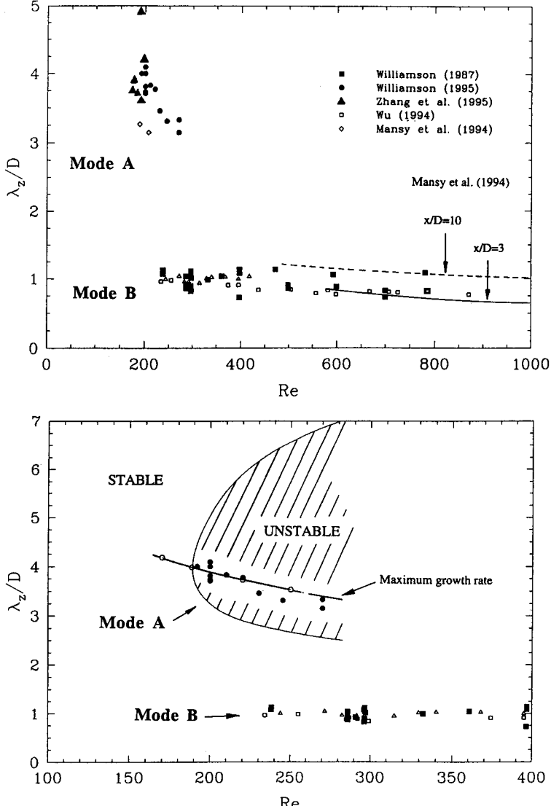

**Figure 14** Spanwise instability wavelengths of the two 3-D instabilities. Normalized spanwise wavelength of streamwise vortex structures ( $\lambda_z/D$ ) vs  $Re$ . Note that there are two distinct wavelengths for mode A and B instabilities. The lower plot comprises only part of the collected data of the upper plot and compares experimental data for mode A instability wavelengths with the Floquet analysis of Barkley & Henderson (1995). (From Williamson 1995a.)

<!-- page 37 -->

surfaces colored yellow and blue mark a particular value of positive and negative streamwise vorticity **(ox)** and the red surface marks a value of spanwise vorticity **(oz).** A further mode C 3-D instability has been proposed by Zhang et al (1995), for *Re* = 170-270, based on the approximate stability analysis of Noack & Eckelmann (1994). In their analysis, Noack & Eckelmann find a spanwise instability wavelength of *hz/D* = 1.8, which is also observed in the experiments and simulations of Zhang et al. However, this mode has not been detected in any of the other studies to date. In the full Floquet stability analysis of Barkley & Henderson (1995), they found no unstable wavenumbers outside of the neutral stability curve of Figure 146, and they found *hz/D* = 1.8 to be a stable wavelength at these *Re.* In the numerical simulations and experiments of Zhang et al, it appears that this mode C is the result of forcing on the nominally 2-D flow, in this case using an interference wire placed close to and parallel to the cylinder *a;\;s.* Presumably, if one interferes with the 2-D flow field in other ways, one can induce still further 3-D instability wavelengths and modes. It appears, at this point, that the *nuturd* wake comprises only the two distinct instabilities yielding modes A and B.

A central question pertains to the origin of these three-dimensional instabilities, and it seems from the jump in length scale that there exist two different (but related) 3-D instability phenomena. The first mode A would appear to be due to an elliptical instability of the primary vortex core during the process of shedding, which causes a spanwise waviness (Williamson 1988b, 1995a). At each spanwise location where the vortex is displaced upstream towards the cylinder, the vortex becomes highly deformed by the strain-rate field, and part of the vortex is pulled back towards the body, forming a vortex loop. This vortex deformation, coupled with streamwise vorticity stretching in the regions between primary Karman vortices, is described in Williamson (1995a) and in Mittal & Balachandar (199%). Although most of the streamwise vorticity for mode A comes from vorticity initially pulled out of the core into the braid region during shedding, the stretching thereafter occurs in a manner similar to the strong straining near the braid saddle point in a mixing layer (Corcos & Lin 1984, Bernal & Roshko 1986, Meiburg & Lasheras 1988). Williamson (1995a) has suggested that this mode A instability is related to the study of Pierrehumbert & Widnall(l982). They consider a shear layer, which has assumed an equilibrated state comprising an array of Stuart vortices (Stuart 1967), and for which they find streamwise structures arising from a secondary 3-D instability of this primary finite-amplitude flow. Their "translative" mode of instability induces a spanwise waviness of the vortex cores, which is in phase from one primary vortex to the next, as found in the cylinder wake. The most unstable spanwise wavelength (for vortices typical of a shear layer) is around 2/3 of the primary

<!-- page 38 -->

wavelength, which is not only close to the measurements of Bernal & Roshko (1986) for a shear layer, but is reasonably close to the range of values (3/5-4/5) found in the wake. Although it appears that vortex stretching, in the manner found in mixing layers, is believed to be an essential ingredient for the generation of streamwise vorticity in both modes A and B (Williamson 1988b, 1995a; Wu et a1 1994a,b; Lin et a1 1995a), M Konig, BN Noack & H Eckelmann (private communication, 1995) believe that the streamwise structures are a manifestation of Gortler vortices, and they have suggested from simulation that supercritical Taylor numbers exist near the braid regions in the wake, leading to centrifugal instability.

The instability of mode B would not appear to be related to a waviness of the primary vortex **as** in mode A, because these vortices deform much more uniformly along their length. It appears that this streamwise structure is caused by an instability that scales on the thickness of the vorticity layer lying in the braid region (Williamson 1995a), as suggested for the mixing layer by Corcos & Lin (1984). The braid region yields a wavelength of around 1 D from Reynolds numbers of around 300 up to at least 10,000, as shown by Mansy et a1 (1994), Bays-Muchmore & Ahmed (1993), and Lin et a1 (1995b); this is consistent with the independence of spanwise scale found for turbulent mixing layers by Bernal & Roshko (1986). Williamson (1995a) has deduced, from the physical mechanisms causing modes A and B, and from direct visual evidence, that the two distinct modes have distinct symmetries, as shown in Figure 16. Mode A comprises streamwise vortices of one sign that are in a staggered arrangement

#### MODE B

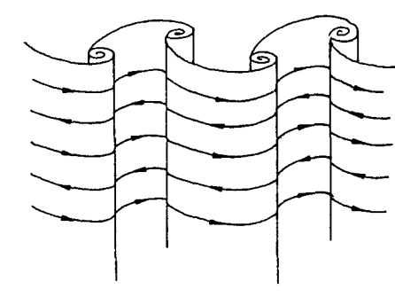

#### MODE **A**

*Figure 16* **Symmetry** of **modes A and B. The natural symmetries of modes A and B are distinctly different, with mode A comprising a staggered sequence of streamwise vortices fromone braid to the next one, and mode B comprising an in-line arrangement. (Diagram taken from Williamson 1995a.)**

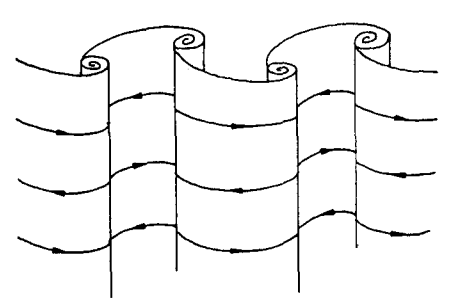

<!-- page 39 -->

from one braid region to the next, whereas mode B has an in-line arrangement of streamwise vortices of the same sign. These patterns are intimately linked to the fact that streamwise vortices formed in a previous half cycle are in the vicinity of newly forming streamwise vortices, a point that has been made clear also by Mittal & Balachandar (1995~). Although the bluff body wake represents a spatially developing flow, Lasheras & Meiburg (1990) have investigated temporal developments in their vortex dynamics computation and have found two types of modes induced by initial perturbations, denoted modes 2 and 1, which correspond closely to the symmetries for modes A and B respectively.

A cross-sectional view of the vortex shedding from experiments, shown earlier in Figure 1, illustrates the position of the streamwise vortices shown previously only in plan view. Due to the use of such an aluminum-flake technique, and the orientation of the light source in this case, **the** white filaments in the braid regions connecting the primary vortices indicate streamwise vorticity, as can be seen in the second photograph for *Re* = 300 (to be contrasted with the case of *Re* = 150). This visualization is strikingly similar to the location of streamwise vortices computed by B Noack (private communication, 1995) from his DNS computations at *Re* = 300, shown in Figure 17a. Streamwise vorticity resides in the braid regions at intermediate *Re* = 4,000 and can also be observed similarly at high *Re* = 270,000, as seen in the Schlieren photograph of Figure 1, taken from Thomann (1959). This photograph was used by Cantwell & Coles (1983) to illustrate one of the saddle-point positions where there is a local maximum in turbulence production, and they suggest that "the phenomenon of turbulence production by vortex stretching near saddles is a general, and even universal, property of turbulent shear flows."

Evidence of the vortex pair structure of mode B, in cross section, is shown clearly in the visualization of Figure 17b, using the laser-induced fluorescence technique. This photograph bears a striking resemblance to the vortex pairs visualized in a mixing layer by Bernal & Roshko (1986). At a similar Reynolds number, Wu et a1 (1994b) have deduced the velocity and vorticity field of such vortices using **PIV** (see Figure 17c). Using such techniques, the streamwise peak vorticity at *Re* = 525 was found to be **ox** *D/ U* = 7, which is larger than the peak spanwise vorticity of the Karman vortices, *w, D/ U* = **4.5.** On the other hand, such measurement techniques show that the streamwise vortex circulations (r,/ UD = 0.4) are much smaller than the primary vortex circulations *(rZ/UD* = 2.5-3.5). Similar results have been found over a large range of *Re*  at least up to 10,000, as shown by the work of Lin et a1 (1995b), and are consistent with data at *Re* = 5,000 (Chyu & Rockwell 1995). Green & Gerrard (1993) have also plotted many of the early estimates of r,/ *U* D in the laminar regime, giving comparable values of the order of 3.0 around *Re* = 100. As

<!-- page 40 -->

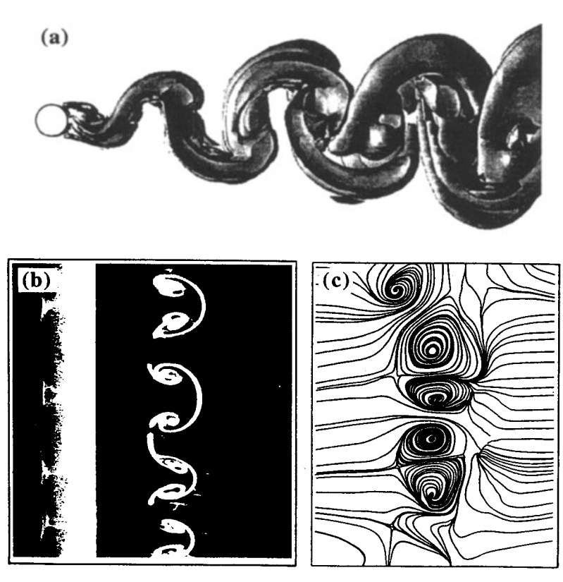

Figure *I7* Cross-sectional views of mode B streamwise vortex structure. The upper crosssectional view in (a) is a cut through a DNS computation of mode B, showing surfaces of constant **streamwise** vorticity. (From B Noack, private communication, 1995.) Note similarity to the case Re = **300** in Figure 1. In (b), we can **see** clearly the smaller-scale mushroom vortex pair structures of mode B vortex shedding, using laser-induced fluorescence. (From Williamson 1995a.) *(c)* PIV measurements from Wu et al(1994), derived from similar vortex pair structures, yield data for their circulation and vorticity.

one may expect, although streamwise vortex circulations are less than primary vortex circulations, the streamwise vorticity is axially stretched in the braid regions between the primary structures, causing strong vorticity amplification.

#### **4.3** *Spot-Like Vortex Dislocations in Transition: Large-Scale Structure*

Small-scale structure in transition, as discussed above, is perhaps to be expected, based on our knowledge **of** other shear flows. However, it is found that wake

<!-- page 41 -->

transition also involves structures that are surprisingly large, and this provides our focus here. Large low-frequency irregularities in the wake velocity fluctuations were first observed by Roshko (1954) in the transition regime. Bloor (1964) later suggested, on the basis of other work by Sat0 & Kuriki (1961), that these low-frequency irregularities reflect the presence of three dimensionalities that would render the flow turbulent as it travels downstream. Almost no work had been undertaken to investigate the physical cause of this phenomenon until recently when it was discovered that these irregularities are due to the existence of vortex dislocations in wake transition (Williamson 1992a). In the transition regime, these vortex dislocations are generated between spanwise cells of different frequency when the primary vortices move out of phase with each other. The dislocations are found to be generated at the sites of particular vortex loops, typical of mode A instability, and evolve spontaneously along the span, independent of the end conditions (Williamson 1995a). (These dislocations in transition should not be confused with those that occur near the ends of a span, in the laminar shedding regime.) Interestingly, dislocations or "defects" have also been found to be a fundamental aspect of free shear layer transition (Browand & Troutt 1980, Browand & Prost-Domasky 1990), and such structures could be important to transition in general.

In the transition regime, measured profiles of velocity fluctuation in the wake are distinctly different from those associated with the laminar regime, as illustrated in Figure 18a. For example, the turbulent-flow profile *(Re* = 183) shows a large symmetrical peak in the center plane of the wake, as distinct from the two smaller side peaks for the laminar regime *(Re* = 152), usually associated with the two rows of laminar vortices traveling downstream. Williamson (1992a) showed that the presence of the vortex dislocations induce this large central peak in the profile, as well as the slow decay of fluctuation velocity downstream of the body in Figure 18b. Their presence explains the intermittent irregularities originally found by Roshko (1954), which are shown from his 1967 paper in Figure 18c. Such irregularities grow to dominate the wake as it travels downstream. Evidence of large structure in transition can actually be observed from several visualizations in the literature, including those by Cimbala et a1 (1988), Hama (1957), and Gerrard (1978). An example of a cross-sectional view of some large oscillations in a vortex street from Cimbala et a1 is shown in Figure 19a. A plan view of the wake at *Re* = 210 (Williamson 1992a; Figure 19b) suggests that such large structures occur in clusters, and such appearance of the wake is very typical of the transition regime. In order to study their evolution in detail, dislocations have been (passively) forced to occur at a local spanwise position with the use of a small ring disturbance, creating low-frequency periodic structures (Williamson 1992a; Figure 20-see

<!-- page 42 -->

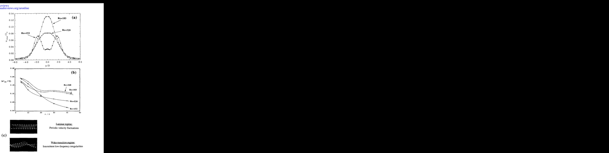

*Figure* 18 Velocity measurements in the transitional wake. *(a)* The rms velocity fluctuation profile measured in both the laminar regime (Re = **152)** and also in the wake-transition regime (Re = 183), at *x/D* = **10.** (b) Downstream decay of normalized rms velocity fluctuations, showing the distinctly different rates of decay in the laminar regime (Re = **152)** vs the transition regime (Re = **183,248).** (Plots from Williamson 1995a.) **(c)** Low-frequency intermittent velocity fluctuations in the transition regime explain the large fluctuation energy measured in the profile and downstream decay plot shown in *(a)* and (b). Such large fluctuation irregularities were first observed by Roshko (1954), and a typical velocity trace (black) from his 1967 paper is included above.

<!-- page 43 -->

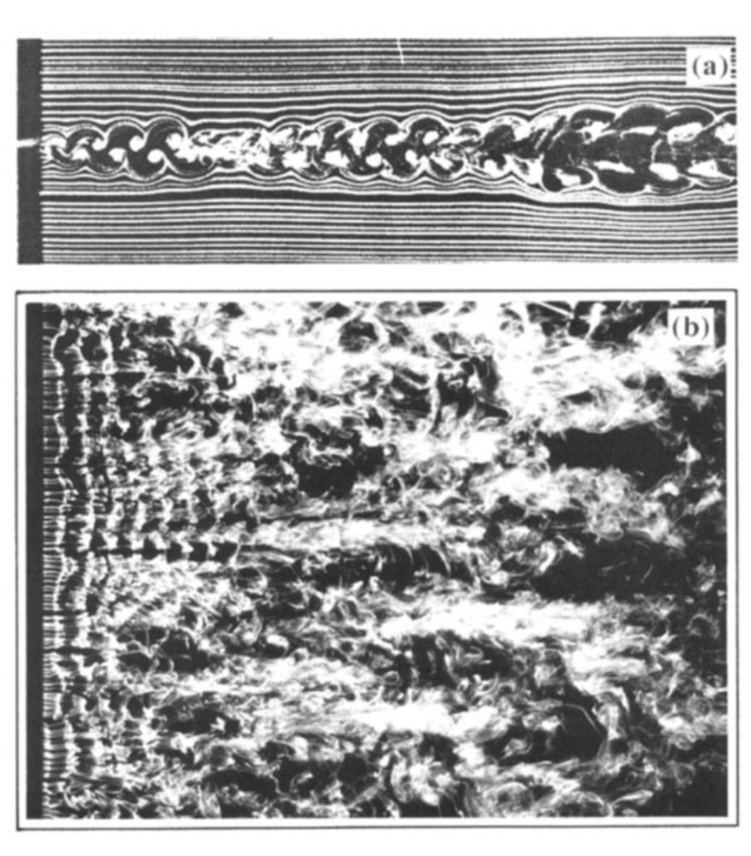

*Figure* 19 Vortex dislocations: origin of low-frequency fluctuations. Recent research has shown that the origin of the large low-frequency irregularities in wake transition, first observed by Roshko (1954), are due to the growth of large vortical structures in the wake. (a) Large structure can be observed in cross-sectional view (Cirnbala et al 1988). Re = 170. (b) Visualization in plan view shows that the fluctuations are due to large structures known as vortex dislocations (Williamson 1992a). Re = 210.

<!-- page 44 -->

color plate) quite typical of structures found in natural transition. Forcing techniques are commonly used for the study of boundary layer spots and have been used by Browand & Prost-Domasky (1990) to study defects in the mixing layer. The spanwise extent of the symmetric dislocation is far larger than the width of the ring-disturbance wake (shown in the figure **as** the yellow dye), and these structures can grow to immense proportions-of the order of 150 diameters (30 wavelengths) in streamwise extent.

The presence of dislocations has been interpreted recently as a vortex adhesion mode by Zhang et a1 (1995). It is believed that the vortex shedding stops or adheres (is glued) to the body at a particular spanwise position. However, periodic or random phase dislocations can often give the appearance of having stopped shedding (one can imagine Figure 20 suggesting this appearance, if there is insufficient dye in the central portions), while in fact they are still clearly shedding vorticity. Zhang et a1 also believe that this adhesion mode is self-sustaining over a wide range of Re from 140 to 230. Although the laminar regime has been extensively studied in both computations and experiments, such self-sustaining vortex adhesion has not as yet been observed by other investigators. On the other hand, vortex dislocations occurring spontaneously and singly along the span as a fundamental feature of wake transition appears to be well established.

## **4.4** *Numerical Simulations* of *Vortex Shedding*

The approach to the bluff body wake problem from DNS has received a great deal of attention recently. Not only are the mean parameters such as Strouhal number, drag force, base pressure, and stresses in the wake well predicted, but the simulations provide a tool to understand the physics of the flow, as has been indicated by the examples shown up to this point. The agreement among the computations and with the experiments is now remarkably good, as shown in Figure 21, for the Strouhal number and base suction coefficient. Because the experimental flow becomes three-dimensionally unstable beyond Re = 194, the DNS computations have enabled us to compare the differences between 2-D and 3-D flows at higher Re, in a manner that is not possible in experiment (0 Kedar & GE Karniadakis 1993, private communication; Henderson 1994; Mittal & Balachandar 1995b). RD Henderson (private communication) has found, for his 2-D computations, that a very good fit to the Strouhal number vs Reynolds number data up to Re = 1,000 is given by *S* = 0.2417 - 0.8328Re exp(-O.O01895Re), suggesting that an asymptote of 0.2417 is reached at large Re. The work of Zhang et a1 (1995) suggests that the first discontinuity and hysteresis, associated with the onset of three dimensionality in experiment, and representing a "hard" transition, can be replaced in simulations by a "soft" transition. The 3-D flow state causes the Strouhal curve

<!-- page 45 -->

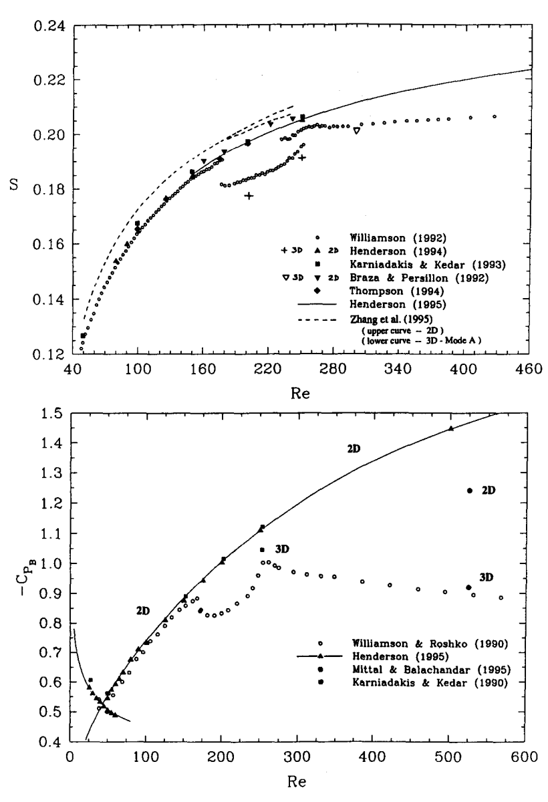

*Figure 21* **DNS computations of shedding frequency and base suction: comparisons between 2-D and 3-D computations and experiment. The upper plot shows Strouhal number S vs Reynolds number** *Re;* **the lower plot shows base suction coefficient vs** *Re.* **Note the marked differences between the 2-D and 3-D computational results.**

<!-- page 46 -->

in Figure 21a to diverge gradually downwards from the 2-D case (although this point is not so clear because their data are surprisingly high compared to all the other simulations). However, Henderson finds that dislocations do appear in his 3-D simulations, and he has found Strouhal numbers close to the lower experimental curve. Combined with further evidence from Williamson (1995a), this shows that the lower experimental curve is a steady solution for the flow and that the upper 3-D curve from Zhang et a1 can be interpreted as a transient case.

In Figure 21b, the base suction coefficient **(-Cpb)** from the 2-D simulations can be predicted for *Re* beyond where the experiments become three dimensional, and it indicates the vast differences between the 2-D and 3-D cases. These differences have been studied by Mittal & Balachandar (1995b), who also explain why the lift and drag in the 2-D case is significantly larger than for the 3-D case [also found for a flat plate geometry by Chua et a1 (1990) and Lisoski (1993)l. Mittal & Balachandar conclude that the overestimation of drag for the 2-D simulation is much more due to the increase of the Reynolds stress pressure term than to the mean flow-field pressure term on the body (if one decomposes the pressure field in this manner). This higher level of Reynolds stresses in the 2-D case is associated with a shorter formation length as the vortices roll up closer to the rear of the body in the 2-D case. The above results are consistent with the decrease in 2-D Reynolds stresses for the 3-D flow, found also by Karniadakis & Triantafyllou (1992).

The study of Karniadakis & Triantafyllou (1992) suggested that the wake becomes three dimensional as a result of a secondary instability of the 2-D vortex street, which is confirmed by Barkley & Henderson (1995) and discussed above. Karniadakis & Triantafyllou state that, as *Re* is increased, the wake velocity fluctuations indicate a cascade of period-doubling bifurcations, which create a chaotic state in the flow at around *Re* = 500. Period doubling in this case refers to the **3-D** structure, rather than inferring the presence of primary vortex pairing (Tomboulides et a1 1992). This scenario has recently been supported by DNS computations of Mittal & Balachandar (199%) and also by the experimental results of Mansy & Williams (1994) and Williams et a1 (1993, using an ingenious scanning laser anemometer. In the experimental wake velocity spectra, not only the 1/2-subharmonic, but also the 1/3-subharmonic, are found in certain ranges of *Re.* Williams et a1 have interpreted these results in terms of symmetric arrays of streamwise vortex structures traveling downstream in the wake. However, it remains as a challenge to visually observe such regular systems of streamwise vortex pairs clearly in the cylinder wake. Despite the evidence above, it appears relevant that Thompson et a1 (1994,1995) do indeed find period doubling in their simulations, but only for small spanwise domains close to 1-1.5 D, and for larger domains there is no evidence of period doubling.

<!-- page 47 -->

The simulations mentioned earlier both have spanwise domains of around 1-1.5 *D,* so the matter of period doubling remains an interesting subject of further research.

Finally, in this section, the recent results of Leweke & Provansal(l995) must be mentioned, although in fact their problem comprises the flow normal to a ring cylinder (or torus). This situation represents, for large aspect ratio, the case of a cylinder with no physical ends, but can be thought of as a flow with periodic boundary conditions, just as in many of the DNS simulations. Leweke & Provansal find a distinct difference between the ring wake and the straight cylinder wake, in that they do not detect a second discontinuity separating mode A from mode B, and instead find a continuous curve as shown in Figure 1 la. This they believe is the valid form for a wake without ends and that the second discontinuity is **an** artifact of the straight cylinder end effects. However, their curve in Figure 1 la is almost precisely the Strouhal curve for mode B, for a straight cylinder, when one induces vortex dislocations along the span (Prasad & Williamson 1995), which suggests that for the torus, in this regime, the requirement of periodic end conditions cannot easily be met without dislocations being generated. This suggestion is supported by their measurements of a very low circumferential wake correlation close to *Re* = 260. DNS computations can give Strouhal numbers along the mode A curve (RD Henderson, private communication; see Figure 1 la) where dislocations are present, whereas DNS computations without dislocations at *Re* = 300 place the Strouhal numbers very close to the experimental (upper) mode-B curve, in line with the straight cylinder experiments. This suggests again that the second discontinuity is an intrinsic phenomenon representing the wake of an infinitely long body and not simply some artifact of the end conditions.

The investigations of the transition regime above have led to a new clarification of the possible flow states or modes through transition, as represented by the *S-Re* plot in Figure 1 Ib, taken from Williamson (1995a). In this plot, the dashed curves are for flow states that are either "unstable," or are transient, in the sense that such states can occur early in a DNS or experimental run, but will later evolve to a different more-stable flow state. When the flow exceeds a critical *Re,* it can follow a soft transition, which corresponds to mode A instability small-scale structure, without dislocations. At some time after the start of the flow, when dislocations develop at some of the vortex loop sites of mode A, the flow then reverts to a state A\*, comprising a mix of both mode A structures and dislocations. At around *Re* = 230 up to 250, there are intermittent periods when mode B instability structures predominate cross the span, yielding the upper frequency curve (B), and periods when the flow is principally mode A structures, with dislocations, yielding the lower frequency curve (A\*). Above

<!-- page 48 -->

*Re* = *250,* the flow remains in the flow state of mode B, without dislocations, unless such dislocations are artificially introduced (Prasad & Williamson **1995),**  in which case one follows the curve marked B\*. This curve is a continuous extension of A\*.

Thus there are two distinct Strouhal curves in Figure **1 lb:** an upper one corresponding to the small-scale instabilities alone and a lower one that represents a combination of the small-scale instabilities plus dislocations. The natural transitioning wake will, however, pass from one flow state to another, in the sequence

$$2D \rightarrow A^* \rightarrow B.$$

Unproven as yet is the possibility that there exists a very small range of *Re*  for which the flow is unstable to small scales of mode A, but whose amplitude is too weak to trigger intermittent vortex dislocations. This would yield the sequence

$$2D \rightarrow A \rightarrow A^* \rightarrow B.$$

In either sequence, natural wake transition comprises two discontinuous changes as *Re* is increased, with a hysteresis at the first discontinuity.

#### **5. THREE-DIMENSIONAL PHENOMENA AT HIGHER REYNOLDS NUMBERS**

#### **5.1** *Shear Layer Instability Vortices*

It has long been known, since the work of Schiller & Linke in **1933,** that the shear layers separating from the sides of a cylinder become turbulent at sufficiently high Reynolds numbers. They found that the normalized distance *XT/D* between the separation point and the transition point in the shear layers decreased from **1.4** to **0.7** as Reynolds numbers increased from **3500** to *8500.*  Although the shear layer transition was considered by Roshko **(1954),** it was not until Bloor **(1964)** that the frequency of the shear layer instability waves was detected. She demonstrated that the (normalized) shear layer instability frequency scaled approximately with *Re'I2,* by considering the thickness and velocity of the separating laminar boundary layer. Drawing essentially on the discussion of Roshko **(1993),** we explain this *Re'/2* dependence in this section.

One would expect the shear layer frequency **fs~** to scale on a velocity near separation **Us~p** and on adimension that we take to be the shear layer momentum thickness *BSL.* This is consistent with the work of Michalke **(1965),** who showed that

| $f_{SL} = 0.017 U_{\text{SEP}} / \theta_{\text{SL}}$ | (6) |
|------------------------------------------------------|-----|
|------------------------------------------------------|-----|

<!-- page 49 -->

The momentum thickness is expected to scale on the thickness of the laminar boundary layer at separation, which Bloor suggested would vary as

$$\theta_{SL} \propto (vD/U_{\infty})^{1/2}.$$
 (7)

Over a range extending from *Re* = lo00 up to 100,000, a rough estimate for the separation velocity may be given by USEp/ *U,* = (1 - **C,b)'/'** = *consrant* = 1.4. If we estimate the Strouhal number to be roughly constant over this range of *Re,* such that *S* = *fK DIU,* = 0.2, then the above equations give

$$f_{\text{SL}}/f_K \propto Re^{1/2}, \quad (8)$$

as first considered by Bloor, and roughly confirmed by her measurements for *Re* > 1300. Since that time, Wei & Smith (1986) have found a somewhat different dependence, over the range 1200-1 1,000, while other studies find roughly the *Re'/'* dependence (Brazaet a1 1986, Kourtaet a1 1987, Sheridan et a1 1992, Filler et a1 1991). For example, Kourta et a1 (1987) find a relationship

$$f_{\text{SL}}/f_K = 0.095 Re^{1/2}. \quad (9)$$

[It should be mentioned that, despite the fact that most investigators claim the *Re'/'* dependence, Prasad & Williamson (1995) show that a best fit to all of the actual data points, from all of the studies combined, is given by a power.] Physically, the shear layer vortices take on the appearance of the vortices so often observed in mixing layers, but in this case the length of the layer is obviously limited by the streamwise extent of the formation region. Evidence of shear layer vortices are seen in Figure 1 at *Re* = 4,000; these are found to amalgamate in the near wake into the Karman vortices, as seen in the PIV-visualization of Lin et a1 (1995a) in Figure 22 (see color plate) for *Re* = 10,000.

From the above studies, one might ask At what *Re* would one expect to first detect or visualize the shear layer vortices? On this point, Una1 & Rockwell (1988) found that shear layer waves were not detectable below *Re* = 1000 on the basis of hot film measurements or below *Re* = 1900 from flow visualization. In all of the studies mentioned above, measurements are not reported for *Re* < 1200. In contrast, Gerrard (1978) found shear layer instability down to *Re* = 350, which remains unexplained. The general lack of shear layer vortices below a Reynolds number of 1200 would seem reasonable based on the discussion of Roshko (1993), **as** outlined below. Based on Equations (6) and (9), one finds

| $\theta_{\text{SL}}/D \sim 1.25/Re^{1/2}$ | (10) |
|-------------------------------------------|------|
|-------------------------------------------|------|

The streamwise wavelength of the shear layer vortices is given by **ASL** = (1/2)Us~p/fs~, which can be combined with (6) and our estimate of *S* to give

$$\frac{1}{2}U_{\text{SEP}}/f_{\text{SL}}$$
, which can be combined with (6) and our estimate of  $S$  to give  $\lambda_{\text{SL}}/D \sim 37/Re^{1/2}$ . (11)

<!-- page 50 -->

One may note that for this instability to appear in the near wake, not only should at least one wavelength be required to fit into the formation length, but also the instability should have reached a significant level of amplification. **A** typical value for the normalized formation length may be taken **as** *LF/D* = **2,** for **Re** of order **1000,** which gives ASL < *LF* when **Re** > **360.** However, to reach a significant amplification, the work of Sat0 **(1956)** suggests that significant amplification (beyond the exponential growth region) is reached only after a transition distance of **XT** = **60 &L** or

| $X_T/D \sim 75/Re^{1/2}$ | (12) |
|--------------------------|------|
|--------------------------|------|

Interestingly, the transition distance **XT** is less than *LF* only for **Re** > **1400,**  which appears to support the lack of observations of shear layer vortices at **Re** < **1200.** The above deductions were essentially put forward by Roshko **(1993).**

The study of Wei & Smith **(1986)** first drew attention to the presence of streamwise vortices in the cylinder wake at Reynolds numbers above the transition regime **(Re** > **1200).** They viewed these streamwise vortices as manifestations of **3-D** instabilities of the shear layer vortices. **As** might be expected, the mechanism generating the mixing layer eddies has a **2-D** origin in the near wake, before being deformed by the **3-D** instabilities, and this is shown clearly from the **2-D DNS** of Braza et a1 **(1990).**

There has also been some work to investigate near and far wake structure in fully turbulent wakes. Grant **(1958),** using correlation measurements, showed that the turbulent far wake develops strong **3-D** vortex structures that occur in counter-rotating pairs inclined to the plane of the wake. Structures similar to these vortex pair eddies were also observed and described by Payne & Lumley **(1967),** Mumford **(1983),** and others. Hayakawa & Hussain **(1989)** later used detection schemes with rakes of hot wires in the near turbulent wake and found that their approximate spanwise distances between the streamwise structures were around 1-2 *D,* whereas measurements from the study of Wei & Smith at **Re** = **3570** and **4530** indicated spanwise wavelengths of around **0.4-0.6** *D.*  These differences suggest that two distinct spanwise length scales exist in the near wake, as shown in Williamson et **al(l995).**

One may expect one length scale based on the **3-D** instability of the Karman vortices, which, judging by existing measurements (see in particular the data of Mansy et a1 for *x/D* = **10** in Figure **14)** and the relatively small changes in the character of vortex shedding over a surprisingly large range of **Re,** would have a spanwise wavelength AZK of around **1 D** or **(1/5)kK** (where AK = streamwise wavelength of the Karman vortices). One may surmise that such a wavelength scales on the dimensions of the primary (turbulent) vortex street, yet is independent of Reynolds number, based on a similar independence of

<!-- page 51 -->

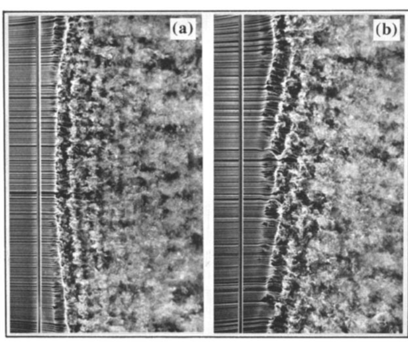

*Figure* **23 Control of flow by end boundary conditions at** *Re* = **5,000. It has proven possible to control oblique and parallel shedding at Reynolds numbers far in excess of the laminar regime. The end boundary conditions have been manipulated (in this case using angled endplates) to yield parallel shedding** *(a)* **and oblique shedding** *(b).* **(From Prasad** & **Williamson** 1995.)

streamwise vortex scale discovered from turbulent mixing layer studies by Bernal & Roshko **(1986).** We may expect a second length scale from the **3-**  D instability of the shear layer vortices. Based now on the results of Bernal & Roshko **(1986),** one might expect a spanwise wavelength *haL* of around *2/3hsL,* giving two scales:

- *(a)* for streamwise vortices in the separating shear layer: *hsL/D* - 25 */Re'I2,*
- *(b)* for streamwise vortices in the wake: *)LZK/D*  1.

#### 5.2 *End Efects: Oblique Shedding Modes, Vortex Dislocations, and Cellular Shedding*

With the recent discoveries of oblique shedding modes, cellular shedding, and vortex dislocations at low Reynolds numbers, there remains the question of

<!-- page 52 -->

whether these characteristics are present at higher Re. This is an important point because the phase of shedding and spanwise correlation would affect the total integrated unsteady forces on a body. In the studies of Norberg (1992), there is some evidence for vortex dislocations at Re up to 10,000. He concludes that these dislocations over the span could explain his observations of a small change of shedding mode around Re = 5000, which can be seen in the base suction plot of Figure **3 as** a small kink. At high Re, there is almost no understanding of the problem of oblique shedding, due in part to the low aspect ratios normally used. A surprising result from Prasad & Williamson (1995) appears to be the ease with which oblique or parallel shedding can be triggered by manipulating the end conditions, in just the same manner **as** in the low-Re studies. Demonstration of turbulent parallel and turbulent oblique shedding for Re - 5000 is demonstrated in Figure 23. At high Reynolds numbers, most of the attention in the literature has been given to the case of low aspect ratios, including the recent study by Szepessy & Bearman (1992), who show a large variation in lift force fluctuations dependent on *LID* and Re. Of relevance to our previous discussions, Szepessy & Bearman showed that the shedding was not, in general, in phase across the span except at very low *LID* = 1.0, and their observed modulations in pressure/velocity measurements for *L/ D* = 7 strongly suggest the presence of dislocations in their flow at Re = 130,000. The question of the conditions under which dislocations and cellular shedding may appear at high Re requires further understanding.

## **6. WAVE INTERACTIONS IN THE FAR WAKE**

Although there have been a large number of investigations concerned with the near wake behind a body, there are relatively few papers whose focus has been to study the structure of far wakes. One of the central issues is whether there is a connection between the flow and vortex dynamics right behind a body (in the near wake) and the structure that is found far downstream of a body (in the far wake). In other words, one might question whether the far wake retains a signature of the details of the near-wake dynamics. In both the laminar and turbulent wake regimes, the width of a nominally 2-D far wake grows as **x1I2,** for large values of downstream distance *x;* we thus expect the size of the large wake structures to increase, while the passage frequency of these structures should decrease. Some original observations by Taneda in 1959 for both laminar and turbulent wakes demonstrated the decay of the original Karman street wake and the growth in the far wake of a larger-scale secondary vortex street, which, he suggested, arises out of a hydrodynamic instability based on the local mean velocity profile. In contrast, Matsui & Okude (1981) suggested that such a secondary street is generated by vortex amalgamations

<!-- page 53 -->

or pairing of the original Karman vortices into larger vortical structures. In a recent computational study, Meiburg **(1987)** showed that vortex pairing would be able to account for the growth of a secondary vortex street.

An extensive experimental study in the laminar regime by Cimbala **(1984)**  and Cimbala et a1 **(1988)** suggested that the far wake structure does not depend directly on the scale or frequency of Karman vortices shed from the cylinder, and correspondingly, that the growth of the secondary structure is due to hydrodynamic instability. The fact that frequencies unrelated to the Karman shedding frequency *f~* were amplified in the far wake (and have good agreement with those predicted from linear stability theory) strongly suggests that hydrodynamic instability is the principal mechanism for secondary street growth. **A** further important contribution of this work was to clearly demonstrate the streakline history effects in some visualization techniques. Figure **24a** shows smoke being introduced upstream atx/d = *5.* One would be tempted to suggest that the original vortex street persists far downstream. However, by introducing smoke downstream at *x/D* = **100** (Figure **24b),** Cimbala et a1 showed that the upper photograph is but a skeleton of the original street, and in fact the downstream wake reorganizes into a larger-scale vortex street.

**A** particularly interesting result from the study of Cimbala et a1 was found from spanwise visualizations, where they discovered a honeycomb-like cellular **3-D** pattern in the far wake (see Figure **24c).** They suggested that this **3-D** pattern could be caused by a secondary **3-D** parametric instability of the subharmonic type acting on the far wake initially **2-D** waves, in analogy with subharmonic resonances found in mixing layers (Pierrehumbert & Widnall **1982)** and in boundary layers. Subsequently, investigations that involve forcing **3-D** structure in far wakes have been undertaken by Lasheras & Meiburg **(1990)** and by Corke et a1 **(1992),** both of whom consider the interactions of subharmonic pairs of oblique waves with a primary **2-D** wave. The work of Corke et a1 shows convincingly the possibilities of **3-D** subharmonic resonances (if they are triggered by suitable waves input into the wake upstream) and is in striking agreement with the analysis of Fleming **(1987).** However, it has remained unclear, until recently, whether such a secondary instability actually occurs in naturally observed wakes, such as the honeycomb-like **3-D** pattern of Cimbala et al. Recent studies show that there is a direct link between the nearwake phenomenon of oblique shedding and the far wake honeycomb pattern of Cimbala et al.

In agreement with the conclusions of Cimbala et al, Hammache & Gharib **(1992)** state that no direct relationship should be expected between the frequencies in the primary and secondary regions. Indeed, they found that, past their region of decay of the Karman street, the secondary vortices are parallel

<!-- page 54 -->

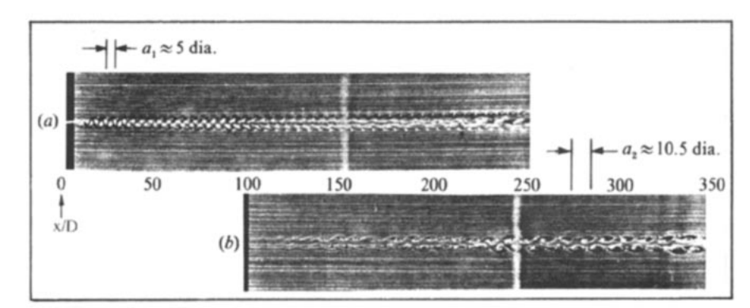

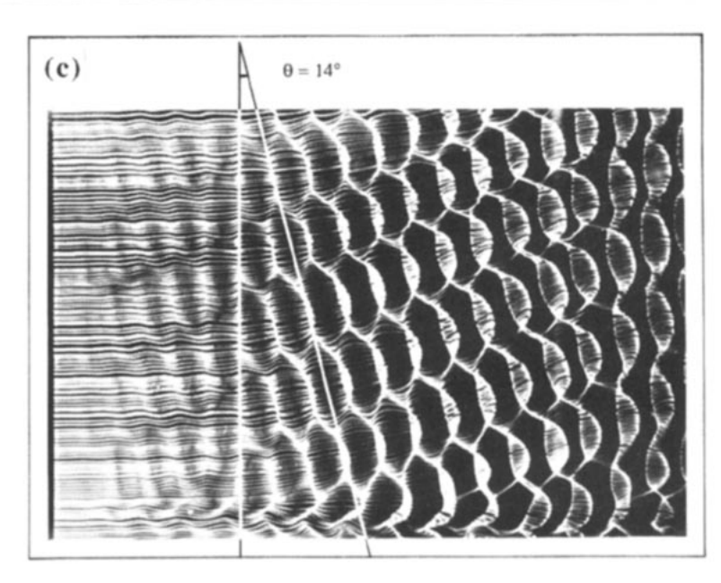

Figure *24* A secondary vortex street and the discovery of a honeycomb-like 3-D pattern in the far wake. The top two cross-sectional views of the cylinder wake show *(a)* the primary Karman vortex street when the smoke is introduced close to the body and (b) a secondary larger-scale vortex street wake when the smoke is introduced downstream at *x/D* = 100. (From Cimbala et al 1988.) In the spanwise view of the wake in *(c),* Cimbala et al discovered a new 3-D honeycomb-like pattern in the far wake, which has led to much speculation in the literature **as** to its origin. Re = 140.

<!-- page 55 -->

(2-D) irrespective of whether there is oblique shedding or parallel shedding upstream, although with oblique shedding there exists a spanwise waviness on the downstream parallel waves. Some careful measurements demonstrated that the spanwise wavelength of the downstream waviness is equal to the spanwise wavelength of the oblique shedding vortices. The results of Williamson (1992b) and Williamson & Prasad (1993a) demonstrate that a honeycomb pattern can be formed as the direct result of an interaction between oblique shedding vortices and 2-D large-scale waves that grow in the far wake. With parallel (2-D) shedding upstream, no honeycomb pattern is found downstream, which proves straightforwardly that the far wake 3-D patterns observed to date (but perhaps not necessarily all 3-D patterns) are dependent on the presence of oblique shedding waves in the wake. It has now been shown that the original patterns of Cimbala et a1 represent the above two-wave interactions. Further research indicates that in natural far wakes, not only the scale but also the frequency is dependent on the near wake (Williamson & Prasad 1993b,c). Surprisingly, the characteristic that actually forges a connection between the near and far wakes is the sensitivity to free-stream disturbances. Indeed, the far wake, being a convectively unstable flow, will tend to amplify extremely small frequency peaks in the free stream. Such free-stream frequencies have been found to be amplified by Cimbala & Krein (1990), who purposefully manipulated the (wind tunnel) free-stream spectrum in their experiments, and also by Desruelle (1983), who subjected the free stream to acoustic forcing. It is significant that, with negligible free-stream turbulence in a DNS computation within the laminar regime by GE Karniadakis and D Newman (private communication, 1995), no far wake secondary structure is observed.

With an understanding of the exquisite sensitivity of the far wake to freestream disturbances, a new mechanism of oblique wave resonance in the far wake has recently been discovered (Williamson & Prasad 1993b,c), which is distinct from the parametric subharmonic instabilities discussed above. A nonlinear (quadratic) interaction between the oblique shedding waves, generated from upstream, and the 2-D waves amplified in the far wake, triggers the growth of an oblique resonance wave, as shown in Figure 25a. In this picture, with flow to the right, the smoke has been introduced into the wake at *x/D* = 50, in order to highlight the three wave systems, as follows. One may observe the oblique shedding waves to the left of the photograph, which are then deformed in the middle of the picture by the growing 2-D waves, to yield large-angle and large wavelength oblique resonance waves in the right half of the picture. The photograph in Figure 2% shows that if the smoke wire is located further downstream at *x/ D* = 100, then what one observes is almost wholly the strong oblique resonance waves. Apparently, one needs only a remarkably small free-

<!-- page 56 -->

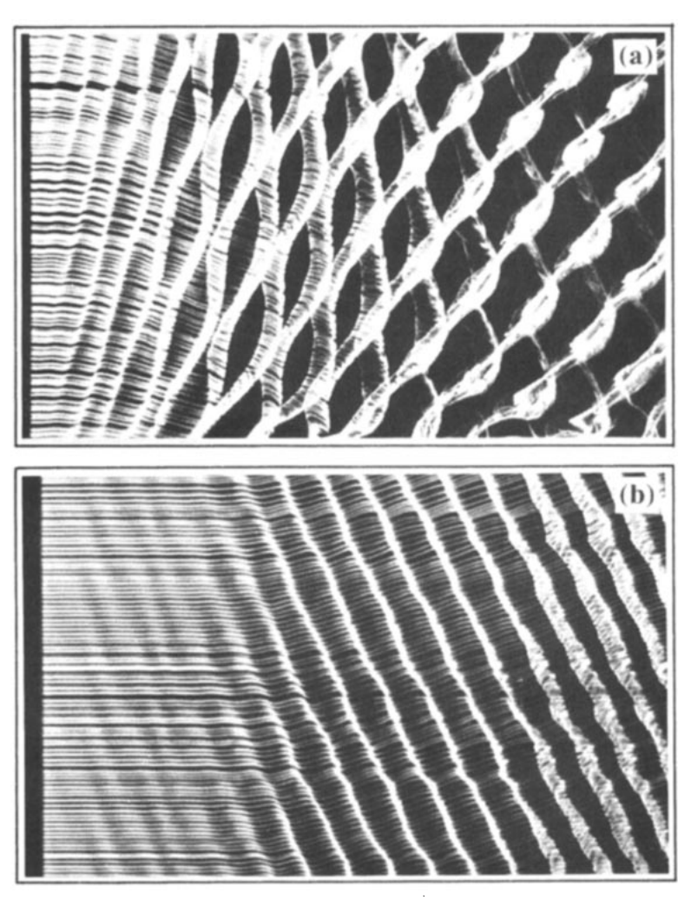

*Figure 25* A mechanism of oblique wave resonance in the far wake. With the smoke wire located at *x/D* = 50 in *(a),* one can observe at the left the oblique shedding waves. These waves interact with the 2-D waves in the middle of the picture to produce the large-angle oblique resonance waves to the right. The lower photograph in (b) shows that, if the smoke is introduced further downstream at *x/D* = **100,** then one observes almost wholly the strong oblique resonance waves. (From Williamson & Prasad 1993b,c.)

<!-- page 57 -->

stream spectral peak (of order *uh,/ U*= 0.00005) to trigger an amplification in the far wake. The disturbances in the free stream of a wind tunnel facility are generally of an acoustic origin and are thus generally 2-D waves.

Measurements of frequency, under conditions of far wake resonance, indicate that the predominant far wake frequency is a combination frequency (fK - fT), where fK is the Karman frequency upstream and fT is the frequency of the 2-D wave. That this frequency corresponds with oblique resonance waves is apparent if one interprets the phenomenon as an example of the type of resonance in fluid mechanics described in Craik's (1985) book. For such resonance, it is required that the following two waves travel at the same phase speed:

| $a_K \exp[i(\alpha_K x + \beta_K z - \omega_K t)]$ , | (13) |
|------------------------------------------------------|------|
|------------------------------------------------------|------|

| $a_T \exp[i(\alpha_T x + \beta_T z - \omega_T t)]$ | (14) |
|----------------------------------------------------|------|
|----------------------------------------------------|------|

where *x* and **z** are the distance downstream and spanwiserespectively. Subscript K refers to the Karman shedding waves, and subscript T to the 2-D waves. With such a two-wave interaction, expect quadratic terms of order *u2* to appear, for example, (uKuT), (uKu;), etc. Let us define a third wave corresponding to **(UKU;)** as

| $a_3 \exp[i(a_3 x + \beta_3 z - \omega_3 t)]$ | (15) |
|-----------------------------------------------|------|
|-----------------------------------------------|------|

where the following relationships may then be written:

| $\omega_3 = \omega_K - \omega_T$ | (16) |
|----------------------------------|------|
|----------------------------------|------|

| $\beta_3 = \beta_K - \beta_T$ | (17) |
|-------------------------------|------|
|-------------------------------|------|

| $\alpha_3 = \alpha_K - \alpha_T$ | (18) |
|----------------------------------|------|
|----------------------------------|------|

A resonance exists if such a relationship between three waves holds true, and this is precisely what is found to exist in this far wake flow. The first relation (16) shows that the resonance wave has a frequency fK - fT; relations (17) and (18) give the geometry of the oblique waves as precisely that found in experiment, namely the resonance waves passing through the nodes formed by the intersection pattern of the other two waves. An investigation into the typical downstream development of velocity spectra, in Figure 26, demonstrates that, although the 2-D waves (frequency fT) are involved in triggering the oblique wave resonance at around *x/D* = 100, they are almost lost in the background noise at *x/d* = 300, whereas the oblique waves (fK - fT) are still relatively energetic, decaying only very slowly as the wake travels further downstream. Oblique wave resonance has also been induced by the use of 2-D wave acoustic forcing (Williamson & Prasad 1993d). A whole set of oblique resonance modes have been found, which correspond to frequencies fK - *It* fT, where *n* is

<!-- page 58 -->

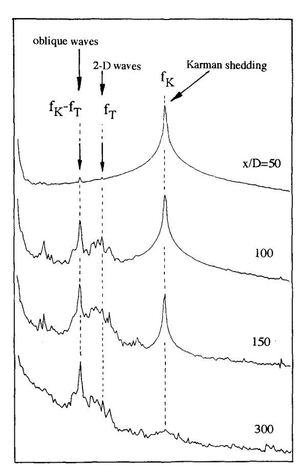

*Figure* 26 Development of downstream velocity fluctuations for oblique wave resonance. The velocity spectra demonstrate that, **as** the wake travels downstream, the energy ofthe oblique **Karman**  shedding frequency *f~* dies out (exponentially), but nevertheless interacts nonlinearly with the 2-D waves (frequency *f~)* sufficiently to trigger the oblique resonance wave (frequency *f~* - *f~).* This resonance wave then grows to become by far the dominant wave further downstream at *x/D* = 300. (From Williamson & Prasad, 1993b,c.)

<!-- page 59 -->

an integer. Surprisingly large angles for the oblique resonance waves *(e,,,* up to at least 75") have been found to be preferentially amplified over the 2-D waves that trigger the resonance. Paradoxically, the effect of an increase in amplitude A of the 2-D wave forcing is to further amplify the oblique resonance waves in preference to the 2-D waves. In summary, the far wake sensitivity to disturbances makes it difficult to properly define a natural wake, because its structure is exquisitely dependent on the environment in which it is studied. In analogy with the mixing layer, the "natural" wake is by nature an excited flow.

#### 7. THREE-DIMENSIONAL EFFECTS IN OTHER WAKE FLOWS

The 3-D phenomena observed in the nominally 2-D flow past a uniform cylinder-for example the oblique and parallel modes of shedding, the cellular shedding, the appearance of vortex dislocations, and the 3-D small-scale instabilities-are all features of several other flows, of which a small selection is discussed here.

There is a very large body of information concerning uniform cylinders that are free or forced to vibrate (see reviews by Bearman 1984, Sarpkaya 1979, Parkinson 1989, Rockwell 1990). One significant feature of these flows, which is closely connected with the present discussion, is the influence on the angle of shedding due to body vibrations. In particular, Berger (1964) discovered that by vibrating a body laterally, the vortices that would otherwise shed at an oblique angle, can be forced to shed parallel to the cylinder, leading to an inhibition of cellular shedding and dislocations and to a delay in the onset of wake transition. The example illustrates again that one can manipulate the three dimensionality in wakes. Conversely, it has also been found that cylinder vibration can dramatically disrupt the formation of oblique and parallel shedding patterns, as found in the studies of Van Atta & Gharib (1987) and Van Atta et a1 (1988). The latter investigation is particularly relevant to the discussions of the present chapter, because it demonstrates clearly that if a very long cylindrical body vibrates as a string, there can exist different cellular shedding patterns associated with the nodes and antinodes of a standing wave pattern and that vortex dislocations will occur.

It is now well known that the complex cases of a wake of a nonuniform cylinder such as a stepped cylinder (Lewis & Gharib 1992), the wake of a cone (Gaster 1969, Piccirillo & Van Atta 1993, Papangelou 1992), and the wake of a uniform cylinder in a shear flow (Maul1 & Young 1973) can cause oblique shedding, cellular shedding, and dislocations. However, one particular example of a uniform cylinder in uniform flow conditions can be found that exhibits all

<!-- page 60 -->

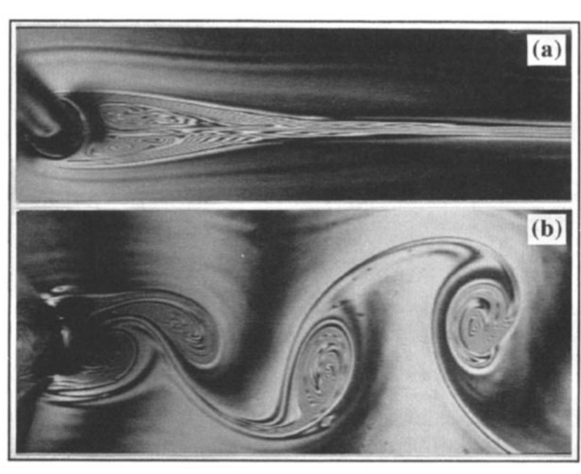

Figure **27** 'ho-dimensional vortex shedding. Utilizing a novel soap-film tunnel, Gharib and coworkers have demonstrated a number of 2-D flow phenomena, one of which is the flow behind a circular disk (or cylinder), which is reported in Gharib & Derango (1989). The flow in the soap film is very thin and is essentially two dimensional. At low (effective) Reynolds numbers *(a),* the steady pair of eddies is found in the wake, until at a critical soap-film flow speed, the wake becomes unstable, thus producing the familiar Karman vortex street (b).

of the above features, namely the wake of a yawed cylinder. A fascinating case is found from the work of Ramberg **(1983),** which demonstrates the simultaneous existence of oblique shedding, parallel shedding, cellular shedding, and dislocations all in the one experimental run. This example also demonstrates the importance of end boundary conditions on the flow over the whole span. Again, it serves to illustrate that the 3-D phenomena described in this review are ubiquitous features of more complex flows.

Having dwelt in this review on the 3-D vortex dynamics of nominally 2-D wakes, one might inquire whether it is possible to set up a truely 2-D experiment "in the real world," as opposed to 2-D DNS "experiments." An invention of Mory Gharib (California Institute of Technology), described as a soap-film tunnel, utilizes a suspended liquid soap film, which is set in motion in a long frame using a planar water jet as a pulling mechanism (Gharib & Derango

<!-- page 61 -->

1989). The flow in the soap film is very thin and is a close approximation to **2-D** flow. As flow speeds are increased, the steady eddies in Figure 27 give way to the Karman **vortex** street, whose frequency has a remarkable agreement with the S-Re relationship for parallel shedding. This novel device is a means to study (almost precisely) **2-D** vortex dynamics in the real world.

#### **8.** CONCLUDING **REMARKS**

Despite the fact that the wake of a bluff body does not easily admit analytical approaches, it is exceedingly rich in flow phenomena. Over the past eight years, there has been a surge of experimental discoveries concerning several aspects of bluff body wakes, but particularly **3-D** aspects. These activities have been matched by new understandings of wake flows coming from analysis and **DNS 2-D** and **3-D** computations. Cellular shedding, vortex dislocations, oblique shedding, phase shocks and expansions, and vortex loops are all **3-D** vortex dynamics phenomena that are becoming understood. As a part of understanding these phenomena, there has been a new appreciation of the effects of end boundary conditions influencing the flow over long cylinder spans. From all of this, one might question what it is that we are trying to understand: Is it the flow over an artificia1,infinitely long body, or the flow over a body with finite span, and therefore under the influence of end boundary conditions? There are scientific and engineering reasons to consider both of these as goals.

In considering the wake vortex dynamics in this review, one may define two kinds of three dimensionality, as introduced in a recent ONR Wakes Workshop in 1992 and further discussed in Roshko (1993): one, which may be called "extrinsic," for example, effects due to end conditions; the other, which may be called "intrinsic," for example, **3-D** motions arising from natural instabilities. One may perhaps consider that extrinsic end effects are extraneous to the flow, although the results of Leweke & Provansal(l995) for the ring cylinder wake (a torus, without physical ends) show that the oblique (helical) shedding is as intrinsic to the flow as parallel (vortex ring) shedding. Given these new results, it might thus be imprecise to label oblique and parallel shedding as extrinsic effects, on the basis that they are incidentally controllable by end conditions.

Finally, one might consider some of the many outstanding questions remaining on the problems of bluff body flows. A central question is: To what extent do the **3-D** vortex dynamics phenomena, recently found for low Reynolds numbers, carry over to high Reynolds number flows? How do the 3-D phenomena influence the steady, and particularly the unsteady, fluid forces on a cylinder? There is the question of whether we can use our improved knowledge regarding **3-D** flow phenomena for uniform cylinders in uniform flows in the cases of other more-complex flows. There are many more specific questions that

<!-- page 62 -->

remain. For example, can we explain, with precision, the origin of mode A and B instabilities? Does period doubling occur in the wake, and, if so, under what precise conditions? Can we explain the mystery **as** to why weakly nonlinear amplitude equations work so well to model so many of the wake patterns far from the control parameter range where they can be justified rationally? These and many other questions remain to be understood.

#### ACKNOWLEDGMENTS

The author would like to thank firstly, and in the most enthusiastic manner possible, Ani1 Prasad for superb practical help and advice in the preparation of this review. Thanks are also due to Gregory Miller and Chantal Champagne PhD for assistance. Thanks must also be given to the following persons for their aid in providing help and material for the review: Marianna Braza, Ron Henderson, Mark Thompson, Michel Provansal, Christoffer Norberg, Thomas Leweke, David Williams, George Karniadakis, Mory Gharib, Don Rockwell, Mikael Konig, Bernd Noack, Helmut Eckelmann, Eckart Meiburg, and others. The continued support over several years from the Ocean Engineering Division of the Office of Naval Research, monitored by Gene Silva, Steven Ramberg, Erik Hendricks, and Tom Swean is gratefully acknowledged. Much of the recent surge of research in this area has directly resulted from an ONR "Bluff Body Wake Vortex Dynamics and Instabilities" Accelerated Research Initiative, of which the present work at Cornel1 is a part (ONR Contract No. N00014-90- 5-1686 and NOOO14-94-1-1197). The several recent ONR Workshops, as well as the 1992 IUTAM Symposium in Gottingen, have been extremely useful in bringing researchers together and in helping us synthesize ideas.

**Any** *Annual Review* **chapter, as well as any article cited in an** *Annual Review* **chapter, may be purchased from the Annual Reviews Preprints and Reprints service. 1-800-347-8007; 415-259-5017; email: arpr9class.org**

## References

*92 references moved to [ref_paper_cyl.refs.md](ref_paper_cyl.refs.md) to keep this file small.*
