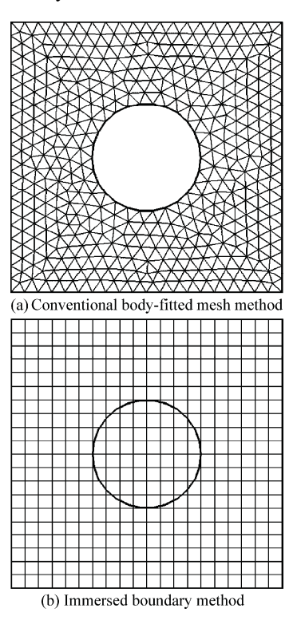
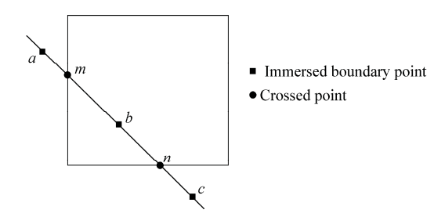
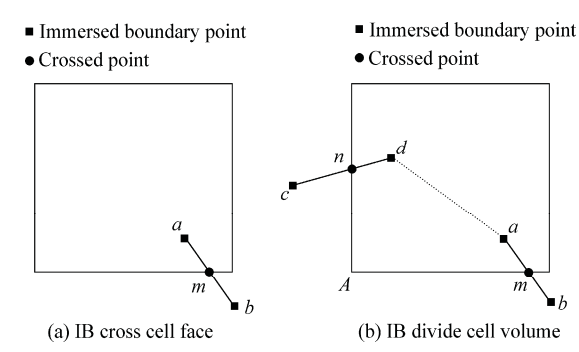
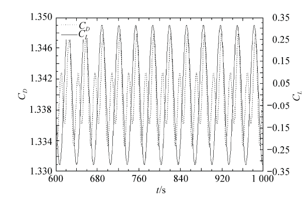
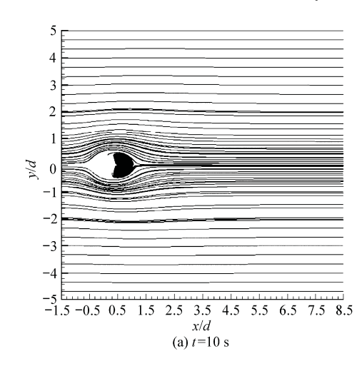
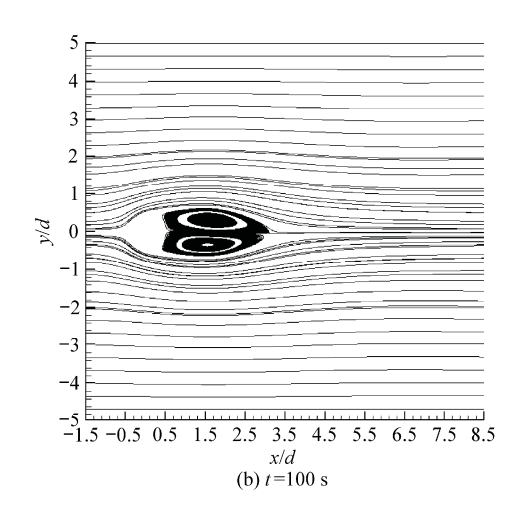
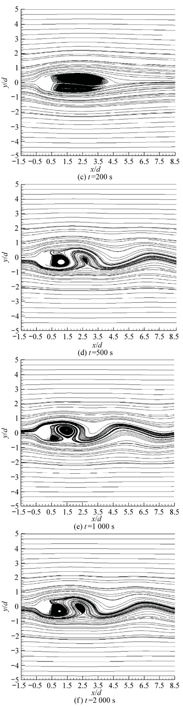
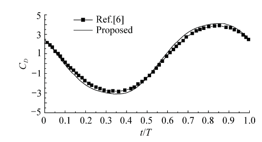
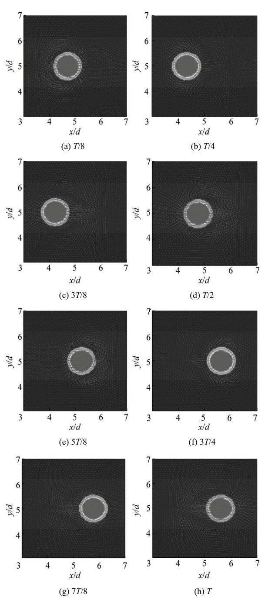

{0}------------------------------------------------

# Numerical Simulation of Low Reynolds Number Fluid-Structure Interaction with Immersed Boundary Method

Ming Pingjian, Zhang Wenping

*School of Power and Energy Engineering, Harbin Engineering University, Harbin 150001, China* 

Received 19 September 2008; accepted 21 April 2009

#### **Abstract**

This article introduces a numerical scheme on the basis of semi-implicit method for pressure-linked equations (SIMPLE) algorithm to simulate incompressible unsteady flows with fluid-structure interaction. The Navier-Stokes equation is discretized spatially with collocated finite volume method and Eulerian implicit method in time domain. The hybrid method that combines immersed boundary method (IBM) and volume of fluid (VOF) method is used to deal with rigid body motion in fluid domain. The details of movement of immersed boundary (IB) and calculation of VOF are also described. This method can be easily applied to any existing finite-volume-based computational fluid dynamics (CFD) solver without complex operation, with which fluid flow interaction of arbitrarily complex geometry can be realized on a fixed mesh. The method is verified by low Reynolds number flows passing both stationary and oscillating cylinders. The drag and lift coefficients acquired by the study well accord with other published results, which indicate the reasonability of the proposed method.

*Keywords:* fluid-structure interaction; immersed boundary method; volume of fluid; vortex shedding; incompressible flow

## **1. Introduction1**

Over the past two decades, time-marching algorithms have found wide application in simulating compressible flows to solve Euler and Navier-Stokes (N-S) equations. However, they are not fit for incompressible flows due to its inefficiency and poor convergence with the reality[1]. Several methods have been developed to overcome this problem and the most successful one seems to be the pressure-based semi-implicit method for pressure-linked equations (SIMPLE) algorithm proposed by S. V. Partankar, et al. in 1972[2], which has been extended to high-Mach-number flows by the authors of Refs.[3]-[4].

Recently, numerical method has attracted evergrowing interest from researchers. They investigate moving bodies in flow fields and, as a result, a few methods have been put forward. Of them, the directly-related one is to use Lagrangian moving mesh to track the interfaces. Unfortunately, it is very inefficient or even impossible to simulate big changes, for which a remeshing procedure is needed to deal with low mesh quality. Some researchers adopted an immersed boundary method to simulate the rigid body's motion on a fixed mesh in the last couple of years. The immersed boundary method was originally proposed by C. S. Peski[5] to analyze the blood flow in a human heart model by merely performing the simulation on a simple Cartesian mesh system, which, in fact, did not conform to the geometry of the heart (non-body-fitted mesh). Since then, the term "immersed boundary (IB)" method (IBM) has begun to be broadly applied, i.e., the body is simply "immersed" in the background mesh domain without fitting the underlying mesh points to the immersed body as practiced in most of the conventional computational fluid dynamics (CFD) approaches[6].

The methods of simulating flows with complex immersed boundaries can be briefly classified into two kinds[7]: ķ To represent the effects of the immersed boundary on the surrounding fluid phase, the immersed boundary is regarded as a "diffuse" interface of finite thickness. The thickness of the boundary is usually of the order of the local mesh spacing. Among this kind of methods, most employ body and/or surface forces and/or mass sources, and also some use the volumeof-fluid and phase-field approaches. The boundary ĸ is tracked as a sharp interface, either explicitly as curves or as level sets on fixed meshes. The communication between the moving boundary and the flow solver is usually accomplished directly by modifying the computational stencil near the immersed boundary. Open access under CC BY-NC-ND license.

 \*Corresponding author. Tel.: +86-451-82569458. *E-mail address:* pingjianming@hrbeu.edu.cn

{1}------------------------------------------------

The second kind is more difficult to use and may require substantial changes of existing CFD codes. Therefore, the first kind is adopted in this article to implement in an in-house code and solve fluid-structure interaction problems in engineering.

#### **2. Computational Scheme**

The conventional method uses structured and/or unstructured meshes that are fitted to the body (bodyfitted mesh), which is very convenient to create a mesh for IBM. Fig.1 shows the difference between IB and conventional body-fitted mesh method.

Fig.1 Different meshing methods.

## *2.1. Governing equation*

The incompressible Navier-Stokes equation can be expressed in an integral form by

$$\int_{\partial\Omega} \rho \mathbf{U} \cdot d\mathbf{S} = 0 \quad (1)$$

for continuity, and

$$\int_{\Omega} \frac{\partial(\rho U)}{\partial t} d\Omega + \int_{\partial\Omega} \rho U U \cdot dS = - \int_{\Omega} \nabla p dV + \int_{\partial\Omega} \mu [\nabla U + (\nabla U)^T] \cdot dS + \int_{\Omega} F dV \quad (2)$$

for momentum.

In Eqs.(1)–(2),  $\Omega$  is the integral domain,  $\partial\Omega$  the boundary,  $d\mathbf{S}$  the elemental area vector,  $d\Omega$  the elemental domain,  $\mathbf{U}$  the velocity vector  $[u \quad v]$ ,  $\rho$  the fluid density,  $\mu$  the fluid dynamic viscosity,  $p$  the static pressure, and  $\mathbf{F}$  the body force vector  $[f_x \quad f_y]$ .

#### *2.2. Numerical scheme*

#### (1) Momentum prediction

Given a certain face flux and pressure, the momentum equation Eq.(2) can be solved for the cell center velocity vector.

With the finite volume method and Eulerian implicit scheme, the linear equations can be obtained as follows:

$$A_{xp}u'_p = \sum A_{xj}u'_j - D \frac{\partial p_x}{\partial x} + Df_x + A_tu''_p \quad (3)$$

$$A_{yp}v'_p = \sum A_{yj}v'_j - D \frac{\partial p^*}{\partial y} + Df_y + A_t v_p^n \quad (4)$$

where  $A_{xp} = \sum A_{xj} + A_t$ ,  $A_{yp} = \sum A_{yj} + A_t, A_{xj}$  and  $A_{yj}$  are neighbor cell influence coefficients in  $x$ - and  $y$ -direction,  $A_t$  is the coefficient related to unsteady term,  $D$  the cell volume,  $p^*$  the initial or intermediate resultant pressure,  $u_p'$  and  $u_j'$  are the velocities in  $x$ -direction of current cell and neighbor cell,  $v_p'$  and  $v_j'$  the counter parts in  $y$ -direction. All these velocities are of current time step values while  $u_p''$  and  $v_p''$  are of previous time step values.

The immersed boundary effects on the flow are realized by volume of fluid (VOF) value. The body forces can be calculated according to the method

$$f_x = \frac{u'' - u'}{\Delta t} \quad (5)$$

$$f_y = \frac{v'' - v'}{\Delta t} \quad (6)$$

where *u* and *v* are the second correction values, which can be linearly interpolated with the fluid and immersed rigid body velocities. This method was also used by K. C. Ng[8]:

$$u'' = (1-\alpha)u' + \alpha u_s^{n+1} \quad (7)$$

$$v'' = (1 - \alpha)v' + \alpha v_s^{n+1} \quad (8)$$

where is the solid fraction within a cell. By substituting *u* and *v* into Eqs.(5)-(6), the following can be acquired

$$f_x = \alpha \frac{u'_s^{n+1} - u'}{\Delta t} \quad (9)$$

$$f_y = \alpha \frac{v_s^{n+1} - v'}{\Delta t} \quad (10)$$

Then the force acting on rigid body can be found by summing up forces over all cells.

$$F_x = -\sum (\rho f_x dV) \quad (11)$$

$$F_y = -\sum (\rho f_y dV) \quad (12)$$

#### (2) Face flux calculation

In order to overcome the check-board pressure distribution, a fourth order damping scheme proposed by C. M. Rhie, et al.[9] is implemented. The cell face flux can be computed by

{2}------------------------------------------------

$$\dot{m}' = \rho U_f' \cdot \mathbf{S} \quad (13)$$

where  $\dot{m}'$  is the face flux,  $U'_f$  the cell face velocity vector [ $u'_f$   $v'_f$ ] and  $\mathbf{S}$  the cell face area vector.

(3) Pressure correction

After predicting the momentum, the velocity does not necessarily satisfy the continuity equation. When the solution converges, the velocity and pressure must satisfy the ensuing momentum equation:

$$A_{xp}u_p = \sum (A_{xj}u_j) - D \frac{\partial p}{\partial x} + D f_x + A_t u_p^n \quad (14)$$

where *u*p, *u*j and *p* are converged results.

By subtracting Eq.(3) from Eq.(14) and neglecting influences of neighbor cells on the third velocity correction, the following equation can be derived:

$$u''' = -\frac{D}{A_{xp}} \frac{\partial p'}{\partial x} \quad (15)$$

Similarly,

$$v'' = -\frac{D}{A_{yp}} \frac{\partial p'}{\partial y} \quad (16)$$

where  $u_p = u_p'' + u_p'''$ ,  $v_p = v_p'' + v_p'''$  and  $p = p^* + p'$ .

The face velocities can be read in the same form as the cell center Eqs.(15)-(16).

$$u_f'' = - \left( \frac{D}{A_{xp}} \right)_f \left( \frac{\partial p'}{\partial x} \right)_f \quad (17)$$

$$v_f'' = - \left( \frac{D}{A_{yp}} \right)_f \left( \frac{\partial p'}{\partial y} \right)_f \quad (18)$$

$$\dot{m}'' = \rho U_f'' \cdot S \quad (19)$$

in which  $m''$  is the face flux modification and  $U_f''$  the cell face velocity vector  $[u_f'' \quad v_f'']$  modification.

$$\sum (\dot{m} + \dot{m}'') = 0 \quad (20)$$

Substituting Eq.(13) and Eq.(19) into Eq.(20) gives

$$-\sum \left[ \rho SD \left( \frac{1}{A_{xp} d_x} + \frac{1}{A_{yp} d_y} \right) (p'_p - p'_l) \right] = -\sum \dot{m}' \quad (21)$$

which is a pressure correction equation. The pressure can be corrected by solving Eq.(21).

(4) Updating flux and velocity

Results:

$$u_p^{n+1} = u'' - \frac{D}{A_{xp}} \frac{\partial p'}{\partial x} \quad (22)$$

$$v_p^{n+1} = v'' - \frac{D}{A_{yp}} \frac{\partial p'}{\partial y} \quad (23)$$

$$u_f = u'_f - \frac{D}{A_{\text{sp}}}(p'_2 - p'_1) \quad (24)$$

$$v_f = v'_f - \frac{D}{A_{yp}}(p'_2 - p'_1) \quad (25)$$

(5) Calculating VOF

As the immersed boundary is tracked by Lagrangian method, it is necessary to decide which cell the point is in. A subroutine "point\_in\_polygon" has been used to determine the situation efficiently. As shown in Fig.2, a line is drawn through the immersed boundary points (IBPs), for instance *a*, *b*, *c*. And the number of points, which have crossed the cell faces on right side of the IBP, is counted. If the number is odd, then the IBP is outside the cell; otherwise, it is in the cell. In Fig.2, there are two points on the right side of point *a*, but none on the right side of point *c*. Thus, points *a* and *c* are outside the cell while there is one crossed point on the right side of the point *b*, meaning in the cell.

Fig.2 Relative position of point and cell.

After deciding the cells containing IBP, the VOF can be calculated. Since VOF can be defined as the ratio of the solid volume in one cell to the cell volume, 1 stands for solid cell and 0 for fluid cell.

In Fig.3(a), there is one boundary line crossing the cell, so there must be at least another line cutting this cell, for example line *cd* in Fig.3(b).

Fig.3 Schematic diagram showing calculation of VOF of immersed body.

As shown in Fig.3(b), the IBPs *a* and *d*, crossed points *m* and *n* and the cell node *A* constitute the solid area polygon 2*Amadn*, which can be divided into three triangles (Ƹ*mAn*, Ƹ*mnd* and Ƹ*mda*), and the solid area equals the sum of the areas of these triangles.

## *2.3. Numerical algorithm*

The computational steps can be summarized as follows.

**Step 1** Start the computation at the time step *n* +1.

**Step 2** Determine the velocities of all IBPs at the time step *n* depending on the prescribed motion.

**Step 3** Update the new position of each IBP at the time step *n*+1 by using individual velocities at the previous time step *n*: 11

$$x^{n+1} = x^n + u_s^{n+1} dt \quad (26)$$

{3}------------------------------------------------

$$y^{n+1} = y^n + v_s^{n+1} dt \quad (27)$$

**Step 4** With the new position of IBP, calculate the VOF of each cell at the time step *n*+1 by using the method introduced in Section 2.2.

**Step 5** Solve the momentum prediction equations Eqs.(3)-(4) to obtain  $u'$  and  $v'$ .

**Step 6** Update intermediate velocities *u* and *v* with Eqs.(7)-(8).

**Step 7** Calculate the fluxes with Eq.(13).

**Step 8** Solve the pressure correction equation Eq.(21) and obtain the corrected pressure.

**Step 9** Update the velocities with Eqs.(22)-(23) and fluxes with Eqs.(24)-(25).

**Step 10** Repeat the procedure from Step 5 to Step 9 until a converged solution is gained.

**Step 11** Repeat the whole procedure from Step 1 until the end time is reached.

#### **3. Results**

#### *3.1. Stationary cylinder*

To quantify the accuracy of the proposed immersed boundary method, several classical benchmark problems used to validate incompressible flow solvers are computed. The first case is of low Reynolds number 2D unsteady flow over a cylinder with the diameter *d*, which exhibits vortex shedding at Reynolds numbers (*Re* =100). The computational domain is 30*d*²30*d*, the cylinder center 10*d* away from inlet and 15*d* away from both top and bottom boundaries. The number of mesh points is 301²301 uniformly distributed in both streamwise and transverse directions.

The Dirichlet boundary condition of *u*/*u*in = 1 and *v* = 0 m/s is applied to the inlet, a slip wall to both the top and the bottom, and the fixed pressure condition to the outlet boundary are used. As the force acting on the rigid body is given by Eqs.(11)-(12), the drag and lift coefficients can be computed by

$$C_D = \frac{F_x}{\rho u_{in}^2 d / 2} \quad (28)$$

$$C_L = \frac{F_y}{\rho u_{in}^2 d / 2} \quad (29)$$

Table 1 lists the drag and lift coefficients and Strouhal number *Sr*, which well accord with other available data and attest to the reasonability of the proposed method.

**Table 1 Results of flows passing a cylinder at** *Re =* **100**

|          |      | = 100 Method CD | Re CL | Sr    |
|----------|------|-----------------|-------|-------|
| Ref.[10] |      | 1.33            | 0.320 | 0.165 |
| Ref.[11] | 1.35 | 0.014           | 0.300 | 0.175 |
| Ref.[12] | 1.38 | 0.007           | 0.322 | 0.169 |
| Ref.[13] | 1.34 | 0.011           | 0.315 | 0.164 |
| Proposed | 1.34 | 0.008           | 0.313 | 0.165 |

The time history of the steady vortex shedding is illustrated in Fig.4, which displays the variation of frequency of lift coefficient approximately twice the drag coefficient and, in addition, there are two different amplitudes appearing alternately in drag coefficients.

Fig.4 Time history of drag and lift coefficients with steady vortex shedding.

Fig.5 shows the streamline distribution at different time. From it, it is seen that, before 200 s, a pair of symmetric vortices forms behind the cylinder and stretches with time and finally vortex is shed. Fig.5 shows a direct look of the wake behind the cylinder.

{4}------------------------------------------------

Fig.5 Streamline distribution at different time.

#### *3.2 Oscillating cylinder*

To verify the suitability of the proposed method for a moving boundary problem, an in-line oscillating cylinder in stationary fluid is considered. The two characteristic parameters of the flow are the Reynolds number and Keulegan-Carpenter number, which can be determined by

$$Re = \frac{\rho U_{\max} d}{\mu} \quad (30)$$

$$KC = \frac{U_{\max}}{fd} \quad (31)$$

where *U*max is the maximum velocity of cylinder, *f* the frequency of oscillation.

In-line oscillatory motion of the cylinder is typical of a simple harmonic relationship like

m *x*( ) sin(2 ) *t A ft* (32)

where *x*(*t*) is the position of cylinder center and *A*m the amplitude of oscillation.

Then the velocity of the cylinder can be obtained by deriving the position with respect to time˖

$$u_s(t) = -2\pi f A_m \cos(2\pi f t) \quad (33)$$

So the correlation between maximum velocity and amplitude of oscillation is

$$U_{\max} = 2\pi f A_m \quad (34)$$

The computation domain is  $10d \times 10d$ , where  $d = 0.01$  m; the fluid density  $\rho = 1$  kg/m3 and the fluid dynamic viscosity  $\mu = 1.0 \times 10^{-3}$  Pa·s. Given  $Re = 100$  and  $KC = 5$ , can be obtained  $U_{\max} = 0.1$  m/s,  $f = 2$  Hz and  $A_m = 0.007$  957.

Fig.6 shows the numerical results of time history of the drag coefficients in a single period. *T* represents one period. The consistency of the curve with that in Ref.[6] indicates the ability of the proposed method to accurately predict the surface shear stress and the pressure on the cylinder.

Fig.6 Time history of drag coefficients at *Re* =100 and *KC* = 5.

Fig.7 shows the velocity vectors and the VOF contour at different time. With the movement of cylinder, the wake flow of cylinder is changed. There are two symmetry vortices behind the cylinder in most stages.

{5}------------------------------------------------

Fig.7 Velocity vector and VOF contour at different stages in a single period.

## **4. Conclusions**

This article proposes a numerical method for fluid-structure interaction, which combines the immersed boundary method and the volume of fluid method in the framework of pressure-finite volume method. This method can be easily applied to any existing finite-volume-based CFD solver without complex operation.

To verify the proposed method, flows passing a stationary and an oscillating cylinder are taken as examples to be calculated and the results agree well with the available results in the literature. This evidences the reasonability and accuracy of the proposed method.

## **References**

[1] Turkel E. Robust low speed precondition for viscous high lift flows. AIAA-2002-0926, 2002. [2] Patankar S V, Spalding D B. A calculation procedure for heat, mass and momentum transfer in three dimension parabolic flows. International Journal of Heat and Mass Transfer 1972; 15: 1787-1796. [3] Shyy W, Chen M H. Pressure-based multigrid algorithm for flow at all speeds. AIAA Journal 1992; 30(11): 2660-2669. [4] Date A W. Solution of Navier-Stokes equations on nonstagered grid of all speeds. Numerical Heat Transfer, Part B 1998; 33: 451-467. [5] Peskin C S. Flow patterns around heart valves: a numerical method. Journal of Computational Physics 1972; 10: 252-271. [6] Dutsch H, Durst F, Becker S. Low Reynolds number flow around an oscillating circular cylinder at low Keulegan-Carpenter numbers. Journal of Fluid Mechanics 1998; 360: 249-271. [7] Udaykumar H S, Mittal R, Rampunggoon P, et al. A sharp interface cartesian grid method for simulating flows with complex moving boundaries. Journal of Computational Physics 2001; 174: 345-380. [8] Ng K C. A collocated finite volume embedding method for simulation of flow past stationary and moving body. Computers & Fluids 2009; 38: 347-357. [9] Rhie C M, Chow W L. Numerical study of the turbulent flow past an airfoil with trailing edge separation. AIAA Journal 1983; 21(11): 1525-1532. [10] Kim J, Kim D, Choi H. An immersed boundary finite volume method for simulations of flow in complex geometries. Journal of Computational Physics 2001; 171: 132-150. [11] Calhoun D. A Cartesian grid method for solving the two-dimensional stream function-vorticity equations in irregular region. Journal of Computational Physics 2002; 176: 231-275. [12] Russell D, Wang Z J. A Cartesian grid method for modeling multiple moving objects in 2D incompressible viscous flow. Journal of Computational Physics 2003; 191: 177-205. [13] Choi J I, Oberoi R C, Edwards J R, et al. An immersed boundary method for complex incompressible flows. Journal of Computational Physics 2007; 224: 757-784.

## **Biographies:**

**Ming Pingjian** Born in 1980, he recived Ph.D. degree in power machine and engineering from Harbin Engineering University˄HEU˅in 2008 and has been doing postdoctoral research work since then in HEU. His main research interest is computational fluid dynamics.

E-mail: pingjianming@hrbeu.edu.cn

**Zhang Wenping** Born in 1956, he recived Ph.D. degree in marine engineering from Harbin Engineering University in 1992 and now he is a professor there. His research interests include noise and vibration control and computational acoustics.

E-mail: zhangwenping@hrbeu.edu.cn